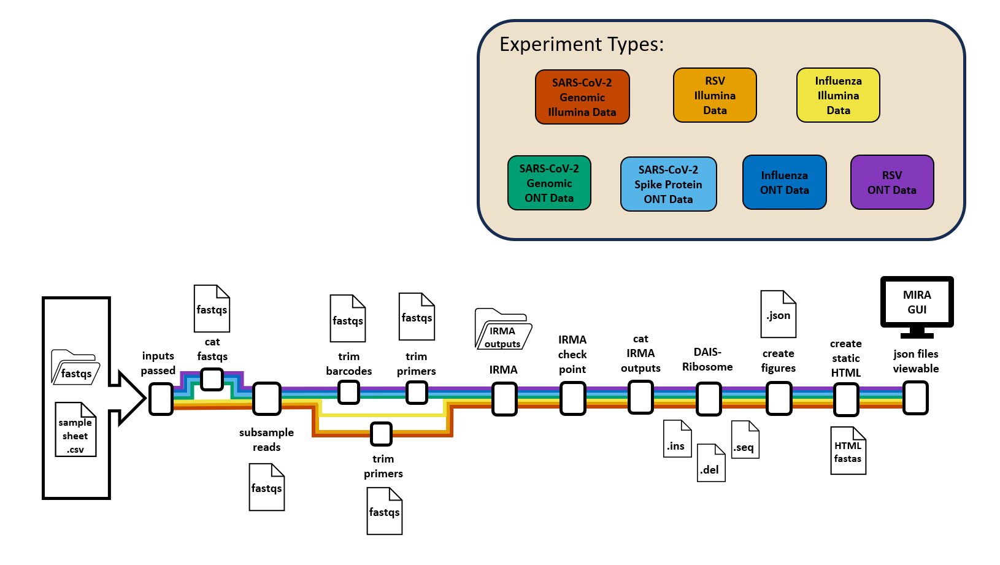

#  MIRA: Interactive Dashboard for Influenza, SARS-CoV-2 and RSV Assembly and Curation


<br>

**General disclaimer** This repository was created for use by CDC
programs to collaborate on public health related projects in support of
the [CDC mission](https://www.cdc.gov/about/organization/mission.htm).
GitHub is not hosted by the CDC, but is a third party website used by
CDC and its partners to share information and collaborate on software.
CDC use of GitHub does not imply an endorsement of any one particular
service, product, or enterprise.

<hr>
<br>

## **Documentation: [https://CDCgov.github.io/MIRA](https://CDCgov.github.io/MIRA)**

### If you've previously installed MIRA and need to upgrade to the latest version, [CLICK HERE](https://CDCgov.github.io/MIRA/articles/upgrading-mira.html)

<br>

# Overview

**MIRA** is an interactive dashboard created using **[Dash](https://dash.plotly.com/introduction)**, a python framework
written on the top of **Flask**, **Plotly.js** and **React.js**. The dashboard
allows users to interactively create a metadata and config file for
running Influenza Genome and SARS-CoV-2 Spike-Gene Assembly. Coming soon, it
will allow for upload via FTP to NCBI’s databases
**Genbank**, **BioSample**, and **SRA**, as well as **GISAID**.

MIRA’s dashboard relies on four Docker containers to run its genome assembly and curation:

- **IRMA (Iterative Refinement Meta-Assembler):** designed for the robust assembly, variant calling, and phasing of highly variable RNA viruses. IRMA is deployed with modules for influenza, ebolavirus and coronavirus.
- **DAIS-Ribosome:** compartmentalizes the translation engine developed for the CDC Influenza Division protein analytics database. The tool has been extended for use with Betacoronavirus.
- **spyne:** a Snakemake workflow manager designed for running Influenza Genome and SARS-CoV-2 Spike-Gene assembly.
- **MIRA:** a GUI web interface that allows users to interactively create a metadata and config file for running Influenza Genome and SARS-CoV-2 Spike-Gene assembly and curation.



<hr>

## Quick Start on Ubuntu OS

_Need to set up an Ubuntu OS? Follow instructions in [Getting Started.](https://CDCgov.github.io/MIRA/articles/getting-started.html)_

### Install Docker CLI and Docker Compose

```bash
sudo apt-get update
```

```bash
sudo apt-get install ca-certificates curl gnupg lsb-release
```

- During installation, you will be prompted to enter 'y' or 'n' to proceed. Each time, input 'y' and click `Enter`

```bash
sudo mkdir -p /etc/apt/keyrings
```

```bash
curl -fsSL https://download.docker.com/linux/ubuntu/gpg | sudo gpg --dearmor -o /etc/apt/keyrings/docker.gpg
```

```bash
echo "deb [arch=$(dpkg --print-architecture) signed-by=/etc/apt/keyrings/docker.gpg] https://download.docker.com/linux/ubuntu $(lsb_release -cs) stable" | sudo tee /etc/apt/sources.list.d/docker.list > /dev/null
```

```bash
sudo apt-get update
```

```bash
sudo chmod a+r /etc/apt/keyrings/docker.gpg
```

```bash
sudo apt-get update
```

```bash
sudo apt-get install docker-ce docker-ce-cli containerd.io docker-compose-plugin
```

5. Verify successful installation

```bash
sudo docker run hello-world
```

- This command downloads a test image and runs it in a container. When the container runs, it prints a confirmation message and exits.

### MIRA Container Installation with Docker Compose

- Create a folder called `FLU_SC2_SEQUENCING` to save your sequencing reads to. From the command line, run:
  
```bash
mkdir ~/FLU_SC2_SEQUENCING

cd ~/FLU_SC2_SEQUENCING
```

- Download the install yml:

```bash
 curl https://raw.githubusercontent.com/CDCgov/MIRA/prod/docker-compose-git.yml | sed "s%/path/to/data%$(pwd)/%g" > docker-compose.yml
```

- Run the install script:

```bash
sudo docker compose up -d
```

- [Click here to download tiny test data from ONT Influenza genome and SARS-CoV-2-spike - 40Mb](https://centersfordiseasecontrol.sharefile.com/d-s839d7319e9b04e2baba07b4d328f02c2)
- [Click here for the above data set + full genomes of Influenza and SARS-CoV-2 from Illumina MiSeqs - 1Gb](https://centersfordiseasecontrol.sharefile.com/d-s3c52c0b25c2243078f506d60bd787c62)
- unzip the file and find two folders:
    1. `tiny_test_run_flu`
    2. `tiny_test_run_sc2`
- move these folders into `FLU_SC2_SEQUENCING`
  - if you cannot find the FLU_SC2_SEQUENCING folder in your Linux section of file explorer, look in Linux-->home-->your username

- Open your browser and type <http://localhost:8020> in the address bar.
- Click `Refresh Run Listing` in MIRA, you should now see these folders listed.
- Click `Download Samplesheet`.
  - This will give you an excel sheet with available barcodes populated. Add in our samplenames for ONT data (Illumina data will self identify samplenames based on fastqs)
- Save the samplesheet and then upload it by clicking on `Drag and Drop your Samplesheet or Click and Select the File`
- In the dropdown box 'What kind of data is this?', select the correct data type.
  - If SC2 full genome, also select your primers.
- Click 'START GENOME ASSEMBLY'
- Toggle 'Watch IRMA progress' to see IRMA's stdout stream.
- When "IRMA is finished!" is displayed,  Click "DISPLAY IRMA RESULTS"

<hr>

## Public Domain Standard Notice

This repository constitutes a work of the United States Government and is not
subject to domestic copyright protection under 17 USC § 105. This repository is in
the public domain within the United States, and copyright and related rights in
the work worldwide are waived through the [CC0 1.0 Universal public domain dedication](https://creativecommons.org/publicdomain/zero/1.0/).
All contributions to this repository will be released under the CC0 dedication. By
submitting a pull request you are agreeing to comply with this waiver of
copyright interest.

## License Standard Notice

The repository utilizes code licensed under the terms of the Apache Software
License and therefore is licensed under ASL v2 or later.

This source code in this repository is free: you can redistribute it and/or modify it under
the terms of the Apache Software License version 2, or (at your option) any
later version.

This source code in this repository is distributed in the hope that it will be useful, but WITHOUT ANY
WARRANTY; without even the implied warranty of MERCHANTABILITY or FITNESS FOR A
PARTICULAR PURPOSE. See the Apache Software License for more details.

You should have received a copy of the Apache Software License along with this
program. If not, see <http://www.apache.org/licenses/LICENSE-2.0.html>

The source code forked from other open source projects will inherit its license.

## Privacy Standard Notice

This repository contains only non-sensitive, publicly available data and
information. All material and community participation is covered by the
[Disclaimer](DISCLAIMER.md)
and [Code of Conduct](code-of-conduct.md).
For more information about CDC's privacy policy, please visit [http://www.cdc.gov/other/privacy.html](https://www.cdc.gov/other/privacy.html).

## Contributing Standard Notice

Anyone is encouraged to contribute to the repository by [forking](https://help.github.com/articles/fork-a-repo)
and submitting a pull request. (If you are new to GitHub, you might start with a
[basic tutorial](https://help.github.com/articles/set-up-git).) By contributing
to this project, you grant a world-wide, royalty-free, perpetual, irrevocable,
non-exclusive, transferable license to all users under the terms of the
[Apache Software License v2](http://www.apache.org/licenses/LICENSE-2.0.html) or
later.

All comments, messages, pull requests, and other submissions received through
CDC including this GitHub page may be subject to applicable federal law, including but not limited to the Federal Records Act, and may be archived. Learn more at [http://www.cdc.gov/other/privacy.html](http://www.cdc.gov/other/privacy.html).

## Records Management Standard Notice

This repository is not a source of government records, but is a copy to increase
collaboration and collaborative potential. All government records will be
published through the [CDC web site](http://www.cdc.gov).

## Additional Standard Notices

Please refer to [CDC's Template Repository](https://github.com/CDCgov/template) for more information about [contributing to this repository](https://github.com/CDCgov/template/blob/main/CONTRIBUTING.md), [public domain notices and disclaimers](https://github.com/CDCgov/template/blob/main/DISCLAIMER.md), and [code of conduct](https://github.com/CDCgov/template/blob/main/code-of-conduct.md).

<hr>
