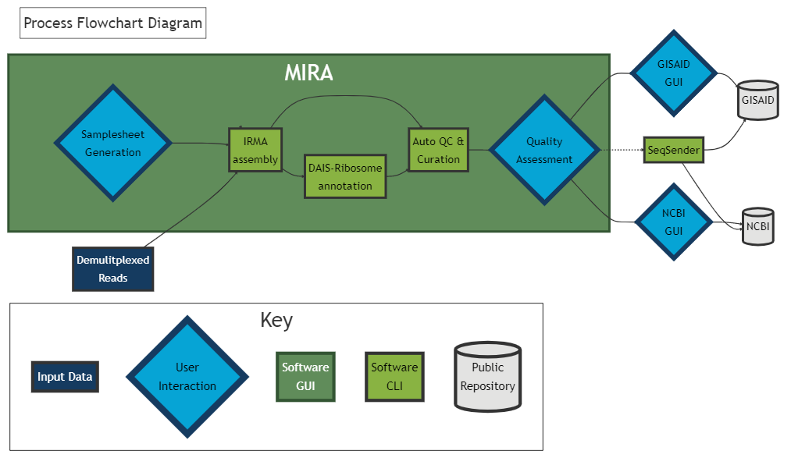

# MIRA: Interactive Dashboard for Influenza Genome and SARS-CoV-2 Spike-Gene Assembly and Curation

Version: 1.0.0 (Beta)

**Beta version** This pipeline is currently in Beta testing and issues
could appear during submission, use at your own risk. Feedback and
suggestions are welcome!

**General disclaimer** This repository was created for use by CDC
programs to collaborate on public health related projects in support of
the [CDC mission](https://www.cdc.gov/about/organization/mission.htm).
GitHub is not hosted by the CDC, but is a third party website used by
CDC and its partners to share information and collaborate on software.
CDC use of GitHub does not imply an endorsement of any one particular
service, product, or enterprise.

<hr>
<br>

## **Documentation: [https://CDCgov.github.io/MIRA/](https://CDCgov.github.io/MIRA/)**

### If you've previously installed MIRA and need to upgrade to the latest version, [CLICK HERE](./articles/upgrading-mira.html)
<br>

# Overview

**MIRA** is an interactive dashboard created using **[Dash](https://dash.plotly.com/introduction)**, a python framework
written on the top of **Flask**, **Plotly.js** and **React.js**. The dashboard
allows users to interactively create a metadata and config file for
running Influenza Genome and SARS-CoV-2 Spike-Gene Assembly. Coming soon, it
will allow for upload via FTP to NCBI’s databases
**Genbank**, **BioSample**, and **SRA**, as well as **GISAID**.


MIRA’s dashboard relies on four Docker containers to run its genome assembly and curation: 

- **IRMA (Iterative Refinement Meta-Assembler):** designed for the robust assembly, variant calling, and phasing of highly variable RNA viruses. IRMA is deployed with modules for influenza, ebolavirus and coronavirus.
- **DAIS-Ribosome:** compartmentalizes the translation engine developed for the CDC Influenza Division protein analytics database. The tool has been extended for use with Betacoronavirus.
- **spyne:** a Snakemake workflow manager designed for running Influenza Genome and SARS-CoV-2 Spike-Gene assembly.
- **MIRA:** a GUI web interface that allows users to interactively create a metadata and config file for running Influenza Genome and SARS-CoV-2 Spike-Gene assembly and curation.



<hr>

## Quick Start on Ubuntu OS:
_Need to set up an Ubuntu OS? Follow instructions in [Getting Started.](./articles/getting-started.html)_

- Create a folder called `FLU_SC2_SEQUENCING` to save your sequencing reads to. From the command line, run: 
  
```bash
mkdir ~/FLU_SC2_SEQUENCING

cd ~/FLU_SC2_SEQUENCING
```

- Download the install yml:
   
```bash
 curl https://raw.githubusercontent.com/CDCgov/MIRA/prod/docker-compose-git.yml | sed "s%/path/to/data%$(pwd)/%g" > docker-compose.yml
```

- Run the install script:

```bash
sudo docker-compose up -d
```
    
- [Click here to download tiny test data from ONT Influenza genome and SARS-CoV-2-spike - 40Mb](https://centersfordiseasecontrol.sharefile.com/d-s839d7319e9b04e2baba07b4d328f02c2)
- [Click here for the above data set + full genomes of Influenza and SARS-CoV-2 from Illumina MiSeqs - 1Gb](https://centersfordiseasecontrol.sharefile.com/d-s3c52c0b25c2243078f506d60bd787c62)
- unzip the file and find two folders:
    1. `tiny_test_run_flu`
    2. `tiny_test_run_sc2`
- move these folders into `FLU_SC2_SEQUENCING`
  - if you cannot find the FLU_SC2_SEQUENCING folder in your Linux section of file explorer, look in Linux-->home-->your username

- Open your browser and type http://localhost:8020 in the address bar.
- Click `Refresh Run Listing` in MIRA, you should now see these folders listed.
- Click `Download Samplesheet`.
  - This will give you an excel sheet with available barcodes populated. Add in our samplenames for ONT data (Illumina data will self identify samplenames based on fastqs)
- Save the samplesheet and then upload it by clicking on `Drag and Drop your Samplesheet or Click and Select the File`
- In the dropdown box 'What kind of data is this?', select the correct data type.
  - If SC2 full genome, also select your primers.
- Click 'START GENOME ASSEMBLY'
- Toggle 'Watch IRMA progress' to see IRMA's stdout stream.
- When "IRMA is finished!" is displayed,  Click "DISPLAY IRMA RESULTS"
    
<hr>
