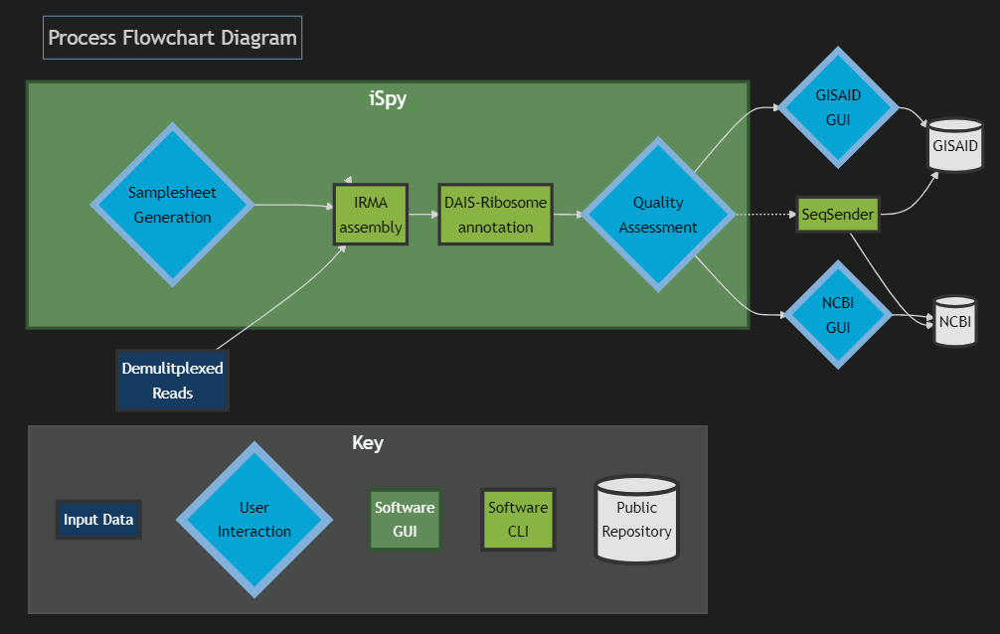

# iSpy: Interactive Dashboard for Influenza Genome and SARS-CoV-2 Spike-Gene Assembly and Curation

Version: 1.0.0 (Beta)

**Beta version** This pipeline is currently in Beta testing and issues
could appear during submission, use at your own risk. Feedback and
suggestions are welcome!

**General disclaimer** This repository was created for use by CDC
programs to collaborate on public health related projects in support of
the [CDC mission](https://www.cdc.gov/about/organization/mission.htm).
GitHub is not hosted by the CDC, but is a third party website used by
CDC and its partners to share information and collaborate on software.
CDC use of GitHub does not imply an endorsement of any one particular
service, product, or enterprise.

<hr>

# Overview

**iSpy** is an interactive dashboard created using **[Dash](https://dash.plotly.com/introduction)**, a python framework
written on the top of **Flask**, **Plotly.js** and **React.js**. The dashboard
allows users to interactively create a metadata and config file for
running Influenza Genome and SARS-CoV-2 Spike-Gene Assembly. Coming soon, it
will generate the files necessary to upload via FTP to NCBI’s databases
**Genbank**, **BioSample**, and **SRA**, as well as **GISAID**.

Below is a flowchart diagram that illustrates the process of Influenza Genome and SARS-CoV-2 spike-gene assembly and curation. In generality, the process starts with demultiplexed sequencing reads from an Illumina or Oxford Nanopore Technologies sequencer and finish with high quality genomes ready for submission to public repositories.




The iSpy’s dashboard relies on four Docker containers to run its genome assembly and curation: 

- **IRMA (Iterative Refinement Meta-Assembler):** designed for the robust assembly, variant calling, and phasing of highly variable RNA viruses. IRMA is deployed with modules for influenza, ebolavirus and coronavirus.
- **DAIS-Ribosome:** compartmentalizes the translation engine developed for the CDC Influenza Division protein analytics database. The tool has been extended for use with Betacoronavirus.
- **spyne:** a Snakemake workflow manager designed for running Influenza Genome and SARS-CoV-2 Spike-Gene assembly.
- **iSpy:** a GUI web interface that allows users to interactively create a metadata and config file for running Influenza Genome and SARS-CoV-2 Spike-Gene assembly and curation.

<hr>

## Quick Start:
- <a href="https://raw.githubusercontent.com/nbx0/iSpy/prod/irmavision_install.sh" download>Right click this link and click 'save as'</a> and save it into the folder that you will add new run-folders to.
- Navigate to that folder on the command line and run:
    ```bash
    chmod +x irma_vision_install.sh
    ```
- Run the install script with sudo:
    ```bash
    sudo irma_vision_install.sh
    ```
- Open your browser and type http://localhost:80200 in the address bar

<hr>


## User Guide:
- [Containerizing iSpy with Docker](https://rchau88.github.io/iSpy-docs/articles/docker.html)
- [Running iSpy with Docker-Compose](https://rchau88.github.io/iSpy-docs/articles/docker-compose.html)
- [Getting started with NGS Training using iSpy](https://rchau88.github.io/iSpy-docs/articles/getting-started.html)

