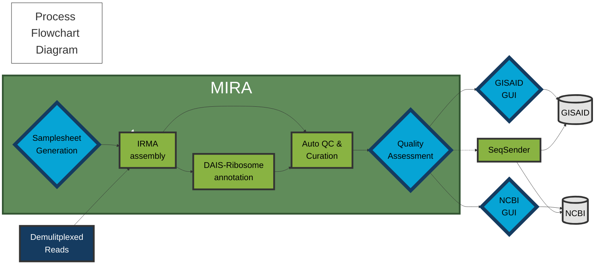
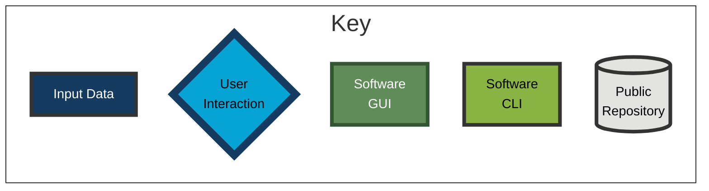

```mermaid
flowchart LR

title[<font size=6>Process Flowchart Diagram]
title --> B
linkStyle 0 stroke:#FFF,stroke-width:0;

subgraph SPY[<font size=12>MIRA]
S{<font size=5>Samplesheet\nGeneration} --> B
B --> C[<font size=5>DAIS-Ribosome\nannotation]
B --> D1[<font size=5>Auto QC &\nCuration]
C --> D1
D1 --> D{<font size=5>Quality\nAssessment}
end
D -.-> E[<font size=5>SeqSender]
D --> GU{<font size=5>GISAID\nGUI}
GU --> F
D --> NU{<font size=5>NCBI\nGUI}
NU --> G
E --> F[(<font size=5>GISAID)]
E --> G[(<font size=5>NCBI)]
A[<font size=5>Demulitplexed\nReads] --> B[<font size=5>IRMA\nassembly]

style title fill:#FFFFFF,stroke:#000000
style A fill:#153b60,color:#FFFFFF,stroke:#333,stroke-width:5px
style B fill:#89b342,color:#000000,stroke:#333,stroke-width:5px
style B fill:#89b342,color:#000000,stroke:#333,stroke-width:5px
style C fill:#89b342,color:#000000,stroke:#333,stroke-width:5px
style D1 fill:#89b342,color:#000000,stroke:#333,stroke-width:5px
style S fill:#06a4d5,color:#000000,stroke-width:10px,stroke:#153b60
style D fill:#06a4d5,color:#000000,stroke-width:10px,stroke:#153b60
style E fill:#89b342,color:#000000,stroke:#333,stroke-width:5px
style F fill:#e3e3e2,color:#000000,stroke:#333,stroke-width:5px
style G fill:#e3e3e2,color:#000000,stroke:#333,stroke-width:5px
style NU fill:#06a4d5,color:#000000,stroke-width:10px,stroke:#153b60
style GU fill:#06a4d5,color:#000000,stroke-width:10px,stroke:#153b60
style SPY fill:#608c5a,color:#FFFFFF,stroke:#353,stroke-width:5px
```

```mermaid
flowchart LR
subgraph KEY[<font size=6>Key]
I[<font size=4>Input Data]
U{<font size=4>User\nInteraction}
SG[<font size=4>Software\nGUI]
SC[<font size=4>Software\nCLI]
P[(<font size=4>Public\nRepository)]
end
style KEY fill:#FFFFFF,stroke:#000000
style I fill:#153b60,color:#FFFFFF,stroke:#333,stroke-width:5px
style SC fill:#89b342,color:#000000,stroke:#333,stroke-width:5px
style SG fill:#608c5a,color:#FFFFFF,stroke:#353,stroke-width:5px
style U fill:#06a4d5,color:#000000,stroke-width:10px,stroke:#153b60
style P fill:#e3e3e2,color:#000000,stroke:#333,stroke-width:5px
```
