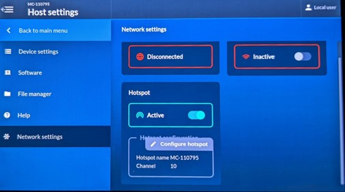
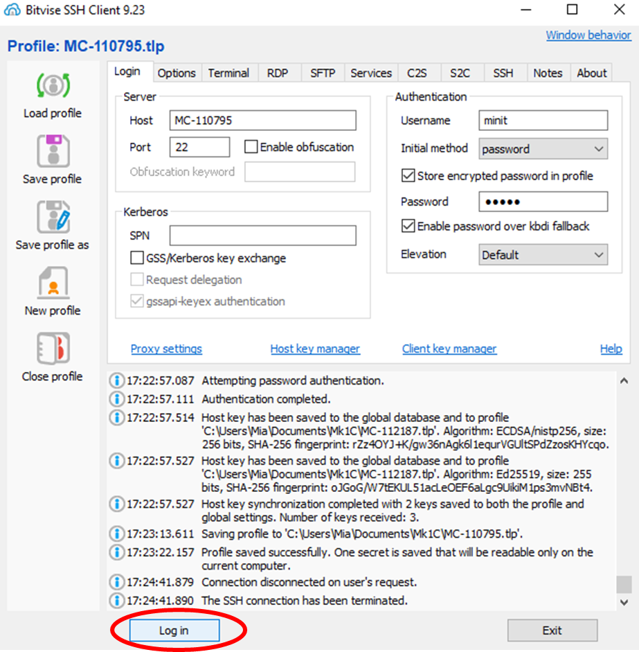
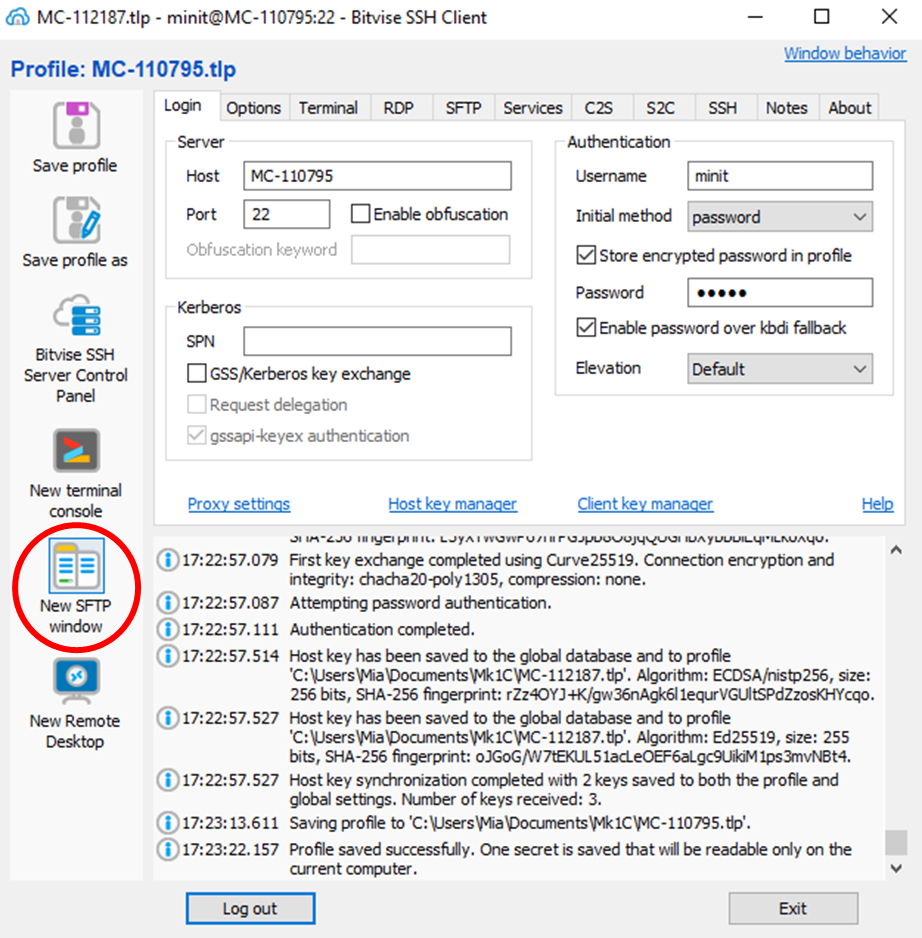
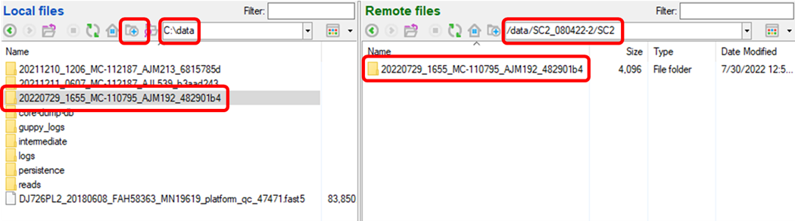
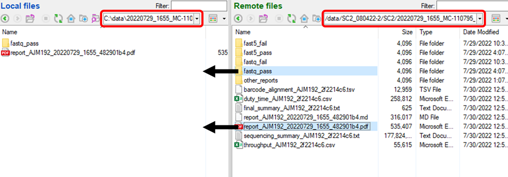

## Local Data Transfer from the Mk1C Sequencing Device for Downstream Analysis ##

_Once your MinION Mk1C sequencing run completes, these instructions detail how to transfer your reads from the machine to your computer, staging them for assembly and analysis with MIRA_

### 1. Install Bitvise SSH Client ###

[Click Here](https://dl.bitvise.com/BvSshClient-Inst.exe) to install Bitvise SSH Client

### 2. Establish a Connection to the MinION Mk1C ###

* From the MinION Mk1C main menu, navigate to host settings then network settings
* Disable WiFi and activate the Hotspot
* Note the hotspot name (MC-######)
    * Optional, change the Hotspot network name and password

* From the laptop, connect to the WiFi network that matches the Mk1C hotspot name
    * Enter the default password WarmButterflyWings98 or the updated password
    * Note the laptop will not have internet access after this step

### 3. Move the Sequencing Data ###

* Open bitvise SSH client
    * Enter the login information for the MinION Mk1C
    * Host: MC-######
    * Username: minit
    * Initial method: password 
    * Password: minit
    * Enable password over kbdi fallback
    * Elevation: Default
    * Login

* Open a new SSH File Transfer Protocol (SFTP) window

* Prepare the ExperimentID folder
    * In Local files, navigate to Linux --> home --> [user] --> FLU_SC2_SEQUENCING (Windows) or home --> FLU_SC2_SEQUENCING (Mac)
    * In Remote files, navigate to /data/[ExperimentID]/[SampleID] and copy the RunID to the clipboard
        * The RunID is generated by the MinKNOW software and is formatted:
            * YYYYMMDD_HHMM_MC-######_[FlowcellID]_[ID]
            * ex. 20220729_1655_MC-110795_AJM192_482901b4
        * Two slow clicks, Ctrl+C
    * On the left (in Local Files), create a new folder, paste the RunID, and open that folder

* Move the data
    * On the right navigate remote files to /data/[ExperimentID]/[SampleID]/[RunID]
    * On the left (local files), you should already have navigated to FLU_SC2_SEQUENCING/[RunID]
    * Drag the fastq_pass folder from the remote files window to the local files window
        * Optional: drag the report.pdf from the remote files window to the local files window

You now have staged yout Mk1C fastqs for analysis! You can proceed to [Running MIRA](./running-mira.html)

