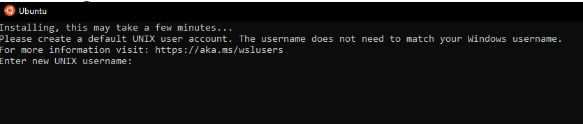
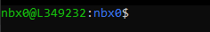
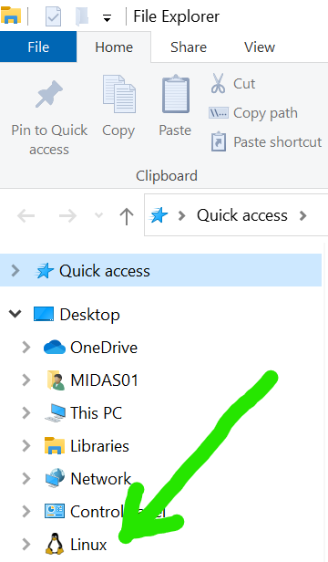
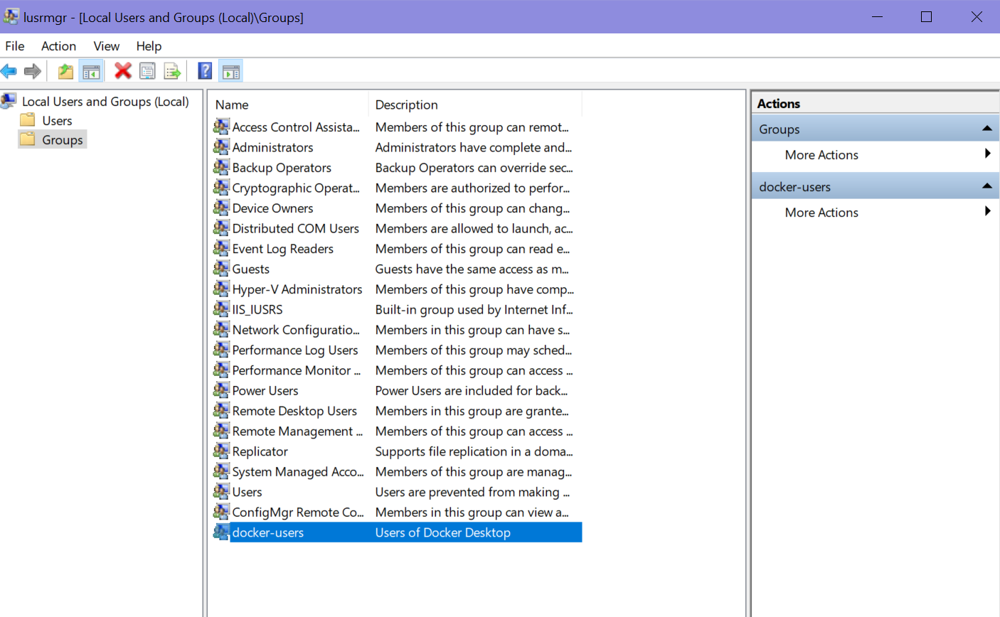
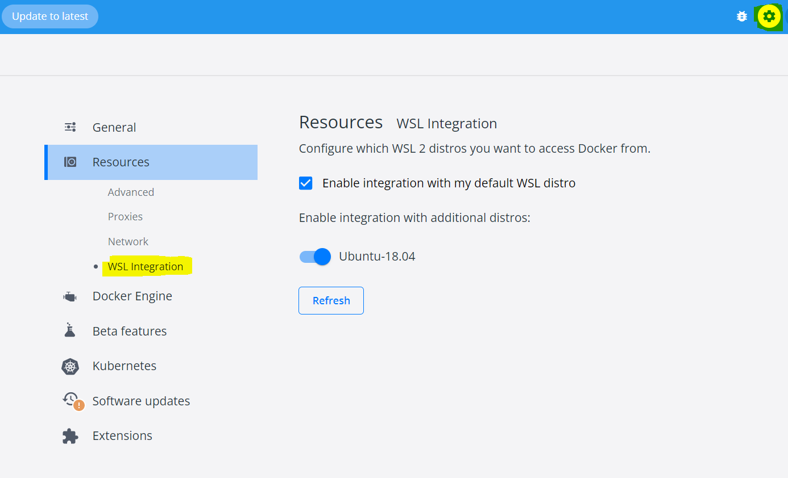

## Contents
### 1. [Computer requirements](#computer-requirements)
### 2. [Install linux on a Windows 10/11 computer](#install-linux-on-a-windows-1011-computer)
### 3. [Map network drive in Window's File Explorer to see folders and files inside WSL](#map-network-drive-to-be-able-to-use-windows-file-explorer-to-see-folders-and-files-inside-wsl)
### 4. [Install Docker Desktop](#install-docker-desktop)
### 5. [Install Docker CLI (Command Line Interface) in WSL2](#install-docker-cli-command-line-interface-in-wsl2)
### 6. [Install a sequence viewer](#install-a-sequence-viewer)

<hr>

## Computer requirements
- A minimum of 16GB of memory is required. >=32GB is recommended.
- A minimum of 8 CPU cores. 16 are recommended.
- **Administrative privileges are required on a Windows operating system _to run linux_.**
- A linux/unix (includes Intel-based* MacOS) operating system is required.
    - *This software has not yet been tested on Apple's M-chip based OS
    - If you are using a Mac, [skip to installing Docker](#install-docker-desktop)

[Return to Contents](#contents)

## Install linux on a Windows 10/11 computer
You can get a full linux environment using Windows Subsystem for Linux, or WSL. The second version of WSL is WSL2 and is the recommended version to use.

1. Check your Windows version and build number, select Windows logo key + R, type winver, select OK.
2. Windows 10 version 2004 and higher (Build 19041 and higher) or Windows 11 is required.
   - You can update to the latest Windows version by selecting Start > Settings > Windows Update > Check for updates.
3. <a href="./images/powershell_open.png" target="_blank">Run powershell **as administrator**</a>
4. Run the following command in Powershell:
    ```bash
    wsl --install
    ```
    - if you see a message relating to Virtualization needing to be enabled, follow instructions below to access your machine's BIOS setup:
        - [Windows 11 virtualization instructions](https://support.microsoft.com/en-us/windows/enable-virtualization-on-windows-11-pcs-c5578302-6e43-4b4b-a449-8ced115f58e1)
        - [Windows 10 virtualization instructions](https://www.geeksforgeeks.org/how-to-enable-virtualization-vt-x-in-windows-10-bios/) 
5. Restart your computer
6. Reopen Powershell and enter the following commands:
    ```bash
    wsl --set-default-version 2
    wsl --install -d Ubuntu-18.04
    ```
    Following successful installation, an Ubuntu terminal should pop up that looks like:
    
7. Enter a username that will be exclusive for WSL. Press `Enter` and then enter a password. **_It is very important_**, _to choose a memorable password. If you forget your password you will need to reinstall Ubuntu_. 

A "prompt" will then appear in the screen like:
     with `nbx0` replaced by your entered username and `L349232` replaced with your computer's name.
8. Restart your computer.

- To access the Ubuntu terminal in the future, simply search for `Ubuntu` in the <a href="./images/ubuntu_open.png" target="_blank">Window's task bar and click on the app.</a> 
<br/><br/>
Further details can be found on Microsoft's website here: [https://docs.microsoft.com/en-us/windows/wsl/install](https://docs.microsoft.com/en-us/windows/wsl/install)
<br/><br/>


[Return to Contents](#contents)

## Map network drive to be able to use Window's File Explorer to see folders and files inside WSL

**_Windows 11 and updated versions of Windows 10 should automatically mount Linux. If you have "Linux" in your `File Explorer`, you are good to go and do not need to perform this step._


**_Many computers have trouble with this step; the folders are not selectable during this step. First, make sure that an Ubuntu terminal is opened and then open the `File Explorer`. If "Ubuntu" is still not showing up in `File Explorer`, you can try to find the solution here: [https://github.com/microsoft/WSL/issues/3996](https://github.com/microsoft/WSL/issues/3996)._


1. Open <a href="./images/file_explorer.png" target="_blank">File Explorer</a>
    - _If you have a Windows 10 or 11 OS, WSL is likely automatically mapped and visible in the left hand sidebar as "Ubuntu"_
2. Right click <a href="./images/map_drive_1.png" target="_blank">This PC and click Map network drive</a>
3. Enter `\\wsl$` into Folder: <a href="./images/map_drive_2.png" target="_blank">and click Browse</a>
4. Click on `wsl$` to unfold directories, select `Ubuntu-18.04` <a href="./images/map_drive_3.png" target="_blank">and click OK</a> and then `Finish`. You should now see your WSL "drive" available in `File Explorer`:

    
    
    
[Return to Contents](#contents)

## [Install Docker Desktop](https://www.docker.com/products/docker-desktop/)
Docker allows you to run software inside an isolated "container image" on your computer with all of that application's needed dependencies. Make sure to install the version for your operating system.
- [Windows](https://desktop.docker.com/win/main/amd64/Docker%20Desktop%20Installer.exe?utm_source=docker&utm_medium=webreferral&utm_campaign=dd-smartbutton&utm_location=header)
- [Mac-Intel](https://desktop.docker.com/mac/main/amd64/Docker.dmg?utm_source=docker&utm_medium=webreferral&utm_campaign=dd-smartbutton&utm_location=module)
- [Mac-AppleChip](https://desktop.docker.com/mac/main/arm64/Docker.dmg?utm_source=docker&utm_medium=webreferral&utm_campaign=dd-smartbutton&utm_location=module)
- [Linux](https://docs.docker.com/desktop/linux/install/)

    - If you get an error related to Docker user groups, go to "Edit local users and groups" from your Windows search bar
    - Click Groups --> docker-users --> Add... --> then enter your username
      

[Return to Contents](#contents)

## [Install Docker CLI (Command Line Interface) in WSL2](https://docs.docker.com/engine/install/ubuntu/)

All following lines of code can be copy/pasted into your terminal. Pasting using `CTRL`+`V` into a terminal my not work. After copying a line of code, try pasting into the terminal with a `right click` of your mouse or trackpad. 

1. Open Ubuntu or Mac terminal
2. Uninstall old versions of Docker
    ```bash
    sudo apt-get remove docker docker-engine docker.io containerd runc
    ```
    - _If you have never installed Docker on your machine, you will see an error message about docker not being found. This is expected and you can move to step 3._
3. Tell WSL2 where to look for Docker CLI tools
    ```bash
    sudo apt-get update
    sudo apt-get install \
    ca-certificates \
    curl \
    gnupg \
    lsb-release
    ```

    - During installation, you will be prompted multiple times to enter 'y' or 'n' on preceeding. Each time, input 'y' and click `Enter`
    ```bash
    sudo mkdir -p /etc/apt/keyrings
    curl -fsSL https://download.docker.com/linux/ubuntu/gpg | sudo gpg --dearmor -o /etc/apt/keyrings/docker.gpg
    ```

    ```bash
    echo \
    "deb [arch=$(dpkg --print-architecture) signed-by=/etc/apt/keyrings/docker.gpg] https://download.docker.com/linux/ubuntu \
    $(lsb_release -cs) stable" | sudo tee /etc/apt/sources.list.d/docker.list > /dev/null
    ```
4. Install Docker CLI
    ```bash
    sudo apt-get update
    ```

    ```bash
    sudo chmod a+r /etc/apt/keyrings/docker.gpg
    sudo apt-get update
    ```

    ```bash
    sudo apt-get install docker-ce docker-ce-cli containerd.io docker-compose-plugin
    ```
5. Verify successful installation
    ```bash
    sudo docker run hello-world
    ```
    - This command downloads a test image and runs it in a container. When the container runs, it prints a confirmation message and exits.
    - Whenever you enter the `sudo` command, you will be prompted for your WSL2 password.
    - If you get an error related to starting Docker, run the following command, then try to run hello-world again
    ```bash
    sudo service docker start
    ```
    - If you get an error related to "Permission Denied" of docker.sock, run the following command, then try to run hello-world again
    ```bash
    sudo chmod -755 /run/docker.sock
    ```
    - If you can now see the hello-world container in Docker Desktop, you can proceed to pulling and running iSpy containers
    - If you open Docker Desktop and do not see the Hello World container you just ran, click Settings icon (top right) --> Resources --> WSL Integration
    - Ensure that "Enable integration with my default WSL distro" is checked off, and that Ubuntu-18.04 distro is switched on
    
    - If your hello-world container still is not showing, open the Ubuntu-18.04 command prompt and run:
    ```bash
    docker run -d -p 80:80 docker/getting-started
    ```


[Return to Contents](#contents)

## Install a sequence viewer
- [Windows Bio Edit](https://bioedit.software.informer.com/)
- [Mac Aliview](https://ormbunkar.se/aliview/#DOWNLOAD)

<hr>
<hr>
<br/><br/>


[Return to Contents](#contents)

## Container Setup
<hr>
iSpy relies on four Docker **_containers_** to run, each of which must be installed using the `docker pull` command inside Linux or Mac Terminal to download the docker **_images_** from the Quay.io repository (IRMA and DAIS-Ribosome are presently stored in AWS's ECR). These **_images_** are then built into runnable **_containers_** with the `docker run` command.
<br/><br/>
If using a Windows PC, you should have already installed WSL2, Docker Desktop, **and** Docker CLI inside WSL2. If you have not, [please return to those instructions.](#how-to-install-linux-on-a-windows-1011-computer)
<br/><br/>

1. Open an Ubuntu or Mac Terminal
2. Pull the container for our genome assembler: [IRMA](https://wonder.cdc.gov/amd/flu/irma/)
    ```bash
    docker pull public.ecr.aws/n3z8t4o2/irma:1.0.2p3
    ```
    - if you see a "Permission Denied" error, try to rerun with sudo before "docker pull"
3. Pull the container for our genome annotator: DAIS-Ribosome
    ```bash
    docker pull public.ecr.aws/n3z8t4o2/dais-ribosome:1.2.1
    ```
4. Pull the container for iSpy's backend "spyne" [Snakemake workflow manager](https://snakemake.readthedocs.io/en/stable/)
    ```bash
    docker pull quay.io/nbx0_cdc/spyne:v1.1.1
    ```
5. Pull the container for iSpy
    ```bash
    docker pull quay.io/nbx0_cdc/ispy:v1.1.0
    ```
6. Create a folder inside Ubuntu that will store your sequencing runs' data.
    ```bash
    mkdir ~/FLU_SC2_SEQUENCING
    ```
    - **_Optional:_** Navigate to `File Explorer` and find this folder inside the Ubuntu mount on the left sidebar. Click on this folder to open its contents and then open `home` and then open the folder named for your WSL _username_. Right click "FLU_SC2_SEQUENCING" and `Create Shortcut`. Move the shortcut folder to a memorable location such as your Desktop.

7. Build the IRMA container
    ```bash
    docker run -v $(readlink -f ~/FLU_SC2_SEQUENCING):/data --name irma-1.0.2p3 -t -d public.ecr.aws/n3z8t4o2/irma:1.0.2p3
    ```
8. Build the DAIS-Ribosome container
    ```bash
    docker run -v $(readlink -f ~/FLU_SC2_SEQUENCING):/data --name dais-ribosome-1.2.1 -t -d public.ecr.aws/n3z8t4o2/dais-ribosome:1.2.1
    ```
9. Build the spyne container
    ```bash
    docker run -v $(readlink -f ~/FLU_SC2_SEQUENCING):/data -v /var/run/docker.sock:/var/run/docker.sock --name spyne -t -d quay.io/nbx0_cdc/spyne:v1.1.1
    ```
10. Build the iSpy container
    ```bash
    docker run -v $(readlink -f ~/FLU_SC2_SEQUENCING):/data -v /var/run/docker.sock:/var/run/docker.sock -d -p 8050:8050 --name ispy quay.io/nbx0_cdc/ispy:v1.1.0
    ```
11. _Optional :_ [Download test data here](https://centersfordiseasecontrol.sharefile.com/d-sb2d3b06e9ef946cf89e1a43c5a141a3f)
    - unzip the file and find two folders
        - tiny_test_run_flu
        - tiny_test_run_sc2
    - move these folders into ~/FLU_SC2_SEQUENCING
    - when you `Refresh Run Listing` in iSpy, you should now see these folders listed
    - when running tiny_test_run_flu, enter barcode numbers `27,37,41` and make up sample names.
    - when running tiny_test_run_sc2, enter barcode numbers `2,3,5,8,28` and make up sample names.
    
You are now ready to run iSpy! You can open it from `Docker Desktop` by clicking on the `Containers` tab on the left sidebar and clicking the icon of the box with the arrow pointing to the top left. This will open iSpy into your default internet browser.


[Return to Contents](#contents)
