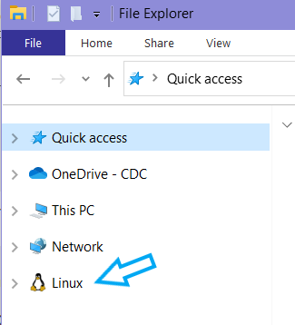

## Computer requirements
- A minimum of 16GB of memory is required. >=32GB is recommended.
- A minimum of 8 CPU cores. 16 are recommended.
- **Administrative privileges are required on a Windows operating system _to run linux_.**
- A linux/unix (includes Intel-based* MacOS) operating system is required.
    - *This software has not yet been tested on Apple's M-chip based OS
    - If you are using a Mac, [go to Mac Getting Started.](./mac-getting-started.html)

## Install linux on a Windows 10/11 computer
You can get a full linux environment using Windows Subsystem for Linux, or WSL. The second version of WSL is WSL2 and is the recommended version to use.

1. Check your Windows version and build number, select Windows logo key + R, type winver, select OK.
2. Windows 10 version 2004 and higher (Build 19041 and higher) or Windows 11 is required.
   - You can update to the latest Windows version by selecting Start > Settings > Windows Update > Check for updates.
3. <a href="./images/powershell_open.png" target="_blank">Run powershell **as administrator**</a>
4. Run the following command in Powershell:

```bash
wsl --install
```

**To paste into a terminal, you "right click"**

If this command errors out, you may need to turn on ["virtualization".](./troubleshooting.html#virtualization-error)

5. Restart your computer
6. Reopen Powershell and enter the following commands:

```bash
wsl --set-default-version 2
```


```bash
wsl --install -d Ubuntu-20.04
```
If either of these commands errors out, try [troubleshooting](./troubleshooting.html#wsl-install-error)


Following successful installation, an Ubuntu terminal should pop up that looks like:


7. Enter a username that will be exclusive for WSL. Press `Enter` and then enter a password. **_It is very important_**, _to choose a memorable password. If you forget your password you will need to reinstall Ubuntu_. 

A "prompt" will then appear in the screen like:
     with `nbx0` replaced by your entered username and `L349232` replaced with your computer's name.

8. Restart your computer.

- To access the Ubuntu terminal in the future, simply search for `Ubuntu` in the <a href="./images/ubuntu_open.png" target="_blank">Window's task bar and click on the app.</a> 
<br/><br/>
Further details can be found on Microsoft's website here: [https://docs.microsoft.com/en-us/windows/wsl/install](https://docs.microsoft.com/en-us/windows/wsl/install)
<br/><br/>

**_Windows 11 and updated versions of Windows 10 should automatically mount Linux. If you have "Linux" in your `File Explorer`, you are good to go and do not need to perform this step._


    
If you do not see this, you need to ["map the WSL drive"](./troubleshooting.html#map-network-drive)

## [Install Docker Desktop](https://www.docker.com/products/docker-desktop/)
Docker allows you to run software inside an isolated "container image" on your computer with all of that application's needed dependencies. Make sure to install the version for your operating system.

- [Windows](https://desktop.docker.com/win/main/amd64/Docker%20Desktop%20Installer.exe?utm_source=docker&utm_medium=webreferral&utm_campaign=dd-smartbutton&utm_location=header)
- [Mac-Intel](https://desktop.docker.com/mac/main/amd64/Docker.dmg?utm_source=docker&utm_medium=webreferral&utm_campaign=dd-smartbutton&utm_location=module)
- [Mac-AppleChip](https://desktop.docker.com/mac/main/arm64/Docker.dmg?utm_source=docker&utm_medium=webreferral&utm_campaign=dd-smartbutton&utm_location=module)
- [Linux](https://docs.docker.com/desktop/linux/install/)

If you get an error related to Docker user groups, go to "Edit local users and groups" from your Windows search bar
Click Groups --> docker-users --> Add... --> then enter your username


## [Install Docker CLI (Command Line Interface) in WSL2](https://docs.docker.com/engine/install/ubuntu/)

All following lines of code can be copy/pasted into your terminal. Pasting using `CTRL`+`V` into a terminal my not work. After copying a line of code, try pasting into the terminal with a `right click` of your mouse or trackpad. 

1. Open Ubuntu or Mac terminal

2. Uninstall old versions of Docker

```bash
sudo apt-get remove docker docker-engine docker.io containerd runc
```
- _If you have never installed Docker on your machine, you will see an error message about docker not being found. This is expected and you can move to step 3._

3. Tell WSL2 where to look for Docker CLI tools

```bash
sudo apt-get update
```

```bash
sudo apt-get install ca-certificates curl gnupg lsb-release
```

- During installation, you will be prompted multiple times to enter 'y' or 'n' to proceed. Each time, input 'y' and click `Enter`

```bash
sudo mkdir -p /etc/apt/keyrings
```

```bash
curl -fsSL https://download.docker.com/linux/ubuntu/gpg | sudo gpg --dearmor -o /etc/apt/keyrings/docker.gpg
```

```bash
echo "deb [arch=$(dpkg --print-architecture) signed-by=/etc/apt/keyrings/docker.gpg] https://download.docker.com/linux/ubuntu $(lsb_release -cs) stable" | sudo tee /etc/apt/sources.list.d/docker.list > /dev/null
```

4. Install Docker CLI

```bash
sudo apt-get update
```

```bash
sudo chmod a+r /etc/apt/keyrings/docker.gpg
```

```bash
sudo apt-get update
```

```bash
sudo apt-get install docker-ce docker-ce-cli containerd.io docker-compose-plugin
```
5. Verify successful installation

```bash
sudo docker run hello-world
```
- This command downloads a test image and runs it in a container. When the container runs, it prints a confirmation message and exits.
- Whenever you enter the `sudo` command, you will be prompted for your WSL2 password.

If you are seeing errors, [click here.](./troubleshooting.html#docker-cli-errors)


## Install a sequence viewer
- [Windows Bio Edit](https://bioedit.software.informer.com/download/#downloading)
- [Mac Aliview](https://ormbunkar.se/aliview/#DOWNLOAD)


#### You are now ready to proceed to [MIRA Installation](./mira-installation.html)
<hr>
<hr>
<br/><br/>


