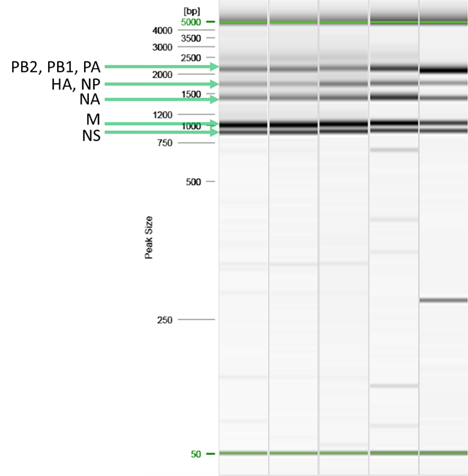

# Multi-segment Reverse Transcription-PCR (MRT-PCR) of Influenza A Viruses for Sequencing
### _Virology, Surveillance and Diagnosis Branch, Genomics and Diagnostics Team (GDT)_

**NOTE: This procedure is provided for research use only. This document is not intended to be used for commercial development or for-profit testing. Use of trade names and commercial sources is for identification only and does not constitute endorsement by the Public Health Service or by the United States Department of Health and Human Services. Please do not distribute this document to other laboratories or commercial entities.**


### 1.0	Purpose
1.1	&nbsp;&nbsp;The purpose of this procedure is to describe a single-reaction multi-segment amplification of influenza A viruses.<br>
<br>


### 2.0	Definitions
2.1	&nbsp;&nbsp;MRT-PCR: multi-segment reverse transcription polymerase chain reaction <br>
2.2	&nbsp;&nbsp;Room temperature: 15-25°C<br>
<br>


### 3.0	Equipment (Use Examples or Equivalent)
3.1	&nbsp;&nbsp;Sterile, nuclease-free 1.5 mL micro-centrifuge tubes <br>
3.2	&nbsp;&nbsp;0.2 mL PCR reaction tube strips or plates <br>
&nbsp;&nbsp;&nbsp;&nbsp;&nbsp;&nbsp;3.2.1	&nbsp;&nbsp;PCR 8-tube strips (Brand Tech Scientific Inc. Catalog. No. 781332) <br>
&nbsp;&nbsp;&nbsp;&nbsp;&nbsp;&nbsp;3.2.2	&nbsp;&nbsp;PCR Plate, 96-well, semi-skirted, flat deck (Life Technologies, Catalog No. AB-1400) <br>
&nbsp;&nbsp;&nbsp;&nbsp;&nbsp;&nbsp;3.2.3	&nbsp;&nbsp;TempPlate pierceable sealing foil, sterile (USA Scientific: Catalog No. 2923-0110) <br>
&nbsp;&nbsp;&nbsp;&nbsp;&nbsp;&nbsp;3.2.4	&nbsp;&nbsp;Sealing Roller (BIO-RAD: Catalog No. MSR-0001) <br>
&nbsp;&nbsp;&nbsp;&nbsp;&nbsp;&nbsp;3.2.5	&nbsp;&nbsp;Silicone compression mat (Sigma Aldrich: Catalog No. AXYCMFLAT) <br>
3.3	&nbsp;&nbsp;Vortex <br>
3.4	&nbsp;&nbsp;1.5 mL tube, 0.2 mL strip tube, and 96 well plate compatible centrifuge <br>
3.5	&nbsp;&nbsp;Cold blocks for 0.2 mL and 1.5 mL PCR reaction tubes (ISC BioExpress) <br>
3.6	&nbsp;&nbsp;Pipettes (10 μL, 20 μL, 200 μL, and 1000 μL) <br>
&nbsp;&nbsp;&nbsp;&nbsp;&nbsp;&nbsp;3.6.1	&nbsp;&nbsp;Multichannel pipettes also recommended (20 µL, and 200 µL) <br>
&nbsp;&nbsp;&nbsp;&nbsp;&nbsp;&nbsp;3.6.2	&nbsp;&nbsp;Corresponding aerosol barrier pipette tips <br>
3.7	&nbsp;&nbsp;Disposable reagent reservoir, sterile (Axygen: Catalog No. RES-V-25-S) <br>
3.8	&nbsp;&nbsp;96-well format PCR Thermocycler System (BioRad: T100) <br>
3.9	&nbsp;&nbsp;1.5 mL tube, 8-tube strip, or 96-well format magnetic separation rack (Life Technologies DynaMag-2: Catalog No. 12321D, Alpaqua Magnum FLX: Catalog No. A000400) <br>
3.10	&nbsp;&nbsp;DNA electrophoresis and visualization equipment (QIAxcel advanced: Catalog No. 9001941) <br>
<br>

### 4.0	Reagents
4.1	&nbsp;&nbsp;Nuclease-free water
4.2	&nbsp;&nbsp;SuperScript™ III One-Step RT-PCR System (Invitrogen: Catalog. No. 12574026 – 100 reactions) <br>
4.3	&nbsp;&nbsp;SPRI beads (Beckman Coulter: Catalog No. A63880, A63881, A63882, or equivalent) <br>
4.4	&nbsp;&nbsp;Molecular biology grade absolute ethanol<br>
<br>


### 5.0	Primers
5.1	&nbsp;&nbsp;Universal primers for Influenza A listed in the Table 1 are from Integrated DNA Technologies Inc. (IDT) http://www.idtdna.com (or equivalent). Primers must be RNase Free HPLC purified. <br>
&nbsp;&nbsp;&nbsp;&nbsp;&nbsp;&nbsp;5.1.1	&nbsp;&nbsp;Prepare 10 µM stocks of each MBTuni-12, MBTuni12.4, and MBTuni13. <br>
&nbsp;&nbsp;&nbsp;&nbsp;&nbsp;&nbsp;5.1.2	&nbsp;&nbsp;Pool these 10 µM stocks in a 2:3:5 ratio respectively. <br>
5.2	&nbsp;&nbsp;CDC provided primers are premixed at 1x strength and dried. <br>	
&nbsp;&nbsp;&nbsp;&nbsp;&nbsp;&nbsp;5.2.1	&nbsp;&nbsp;Reconstitute in 1 mL nuclease-free water.  

#### Table 1: MBTuni primer pools
```{css, echo=FALSE}
th {
  font-weight: bold;
}

th, td {
  border: 3px solid black
}
.center {
  margin-left: auto;
  margin-right: auto;
}
```


<table class="center">
<tr>
<th>Oligo</th>
<th># Bases</th>
<th>Sequence 5'-3'</th>
<th>µM in pool</th>
</tr>
<tr>
<td>MBTuni-12</td>
<td>22</td>
<td>ACGCGTGATCAGCAAAAGCAGG</td>
<td>2</td>
</tr>
<tr>
<td>MBTuni-12.4</td>
<td>22</td>
<td>ACGCGTGATCAGCGAAAGCAGG</td>
<td>2</td>
</tr>
<tr>
<td>MBTuni-13</td>
<td>23</td>
<td>ACGCGTGATCAGTAGAAACAAGG</td>
<td>2</td>
</tr>
</table>

<br>


### 6.0 Samples and Controls
6.1	&nbsp;&nbsp;Samples <br>
&nbsp;&nbsp;&nbsp;&nbsp;&nbsp;&nbsp;6.1.1	&nbsp;&nbsp;Specimens collected from individuals with a positive influenza A diagnostic test that have been inactivated and extracted via filter or bead-based RNA extraction platform.<br>
&nbsp;&nbsp;&nbsp;&nbsp;&nbsp;&nbsp;6.1.2	&nbsp;&nbsp;Propagated isolate derived from such clinical specimens and similarly inactivated and extracted.<br>
6.2	&nbsp;&nbsp;Controls

#### Table 2: Positive and Negative Controls

<table class="center">
<tr>
<th>Control</th>
<th>Material</th>
<th>Frequency</th>
<th>Expected Value</th>
</tr>
<tr>
<td>Positive</td>
<td>Previously sequenced RNA from propagated isolate of currently circulating influenza A virus, Ct <20 
<br> Or <br>
Previously sequenced RNA from clinical sample of currently circulating influenza A virus, Ct <20 
<br> Or  <br>
Stock propagated isolates ordered from the [International Reagent Resource](www.https://www.internationalreagentresource.org/) 
</td>
<td>Every run</td>
<td>Amplicons detectable by electrophoresis </td>
</tr>
<tr>
<td>Negative</td>
<td>Water</td>
<td>Every run</td>
<td>Amplicons not detectable by electrophoresis </td>
</tr>
</table>

### 7.0	Safety Precautions<br>
7.1	&nbsp;&nbsp;Adhere to the safety guidelines provided in the Biosafety in Microbiological and Biomedical Laboratories and follow all established site-specific safety procedures, including wearing proper personal protective equipment (PPE).<br>

### 8.0	Comments and Questions<br>
8.1	&nbsp;&nbsp;Please send comments and questions by email to CDC Influenza Division Technical Support: idseqsupport@cdc.gov <br>
<br>

### 9.0	Gather Reagents<br>
9.1	&nbsp;&nbsp;Thaw and store at the indicated temperature during the procedure.<br>
9.2	&nbsp;&nbsp;Flick/invert the reagent tubes to ensure they are well mixed, and spin down before opening.<br>
9.3	&nbsp;&nbsp;Keep enzymes at in a freezer or on a cold block (approximately -20°C)<br>
&nbsp;&nbsp;&nbsp;&nbsp;&nbsp;&nbsp;9.3.1	&nbsp;&nbsp;SuperScript III RT Mix<br>
9.4	&nbsp;&nbsp;Keep in a refrigerator, cold block, or ice bucket (approximately 4°C)<br>
&nbsp;&nbsp;&nbsp;&nbsp;&nbsp;&nbsp;9.4.1	&nbsp;&nbsp;SSIII 2X Reaction Mix<br>
&nbsp;&nbsp;&nbsp;&nbsp;&nbsp;&nbsp;9.4.2	&nbsp;&nbsp;MBTuni Primer Pool<br>
&nbsp;&nbsp;&nbsp;&nbsp;&nbsp;&nbsp;9.4.3	&nbsp;&nbsp;Samples and Controls<br>
9.5	&nbsp;&nbsp;Room temperature (15-25°C).<br>
&nbsp;&nbsp;&nbsp;&nbsp;&nbsp;&nbsp;9.5.1	&nbsp;&nbsp;Nuclease-free water<br>
&nbsp;&nbsp;&nbsp;&nbsp;&nbsp;&nbsp;9.5.2	&nbsp;&nbsp;SPRI beads (solid-phase reversible immobilization beads)<br>
&nbsp;&nbsp;&nbsp;&nbsp;&nbsp;&nbsp;&nbsp;&nbsp;&nbsp;&nbsp;&nbsp;&nbsp;9.5.2.1	&nbsp;&nbsp;Vortex immediately before use<br>
&nbsp;&nbsp;&nbsp;&nbsp;&nbsp;&nbsp;9.5.3	&nbsp;&nbsp;Freshly prepared 80% ethanol<br>

### 10.0	MRT-PCR Procedure<br>
10.1	&nbsp;&nbsp;Combine the components of Table 3 to prepare a reaction master mix sufficient for all samples and controls.<br>

#### Table 3: RT-PCR master mix for influenza A viruses

<table class="center">
<tr>
<th>Reagent</th>
<th>Volume (µL) Per Reaction</th>
<th>µL Per Master Mix</th>
</tr>
<tr>
<td>Nuclease-free Water</td>
<td>8</td>
<td></td>
</tr>
<tr>
<td>2X Reaction Mix</td>
<td>12.5</td>
<td></td>
</tr>
<tr>
<td>SuperScript III RT Mix</td>
<td>0.5</td>
<td></td>
</tr>
<tr>
<td>MBTuni Primer Pool</td>
<td>1</td>
<td></td>
</tr>
<tr>
<td>**Subtotal**</td>
<td>**22**</td>
<td></td>
</tr>
</table>


&nbsp;&nbsp;&nbsp;&nbsp;&nbsp;&nbsp;10.1.1	&nbsp;&nbsp;Aliquot 22 μL of each reaction mix into respective wells of a 96-well PCR plate or into 0.2 mL PCR tubes. <br>
&nbsp;&nbsp;&nbsp;&nbsp;&nbsp;&nbsp;10.1.2	&nbsp;&nbsp;For each sample, positive control, and negative control add 3 µL of RNA or water. 

10.2&nbsp;&nbsp;	Seal, gently mix, centrifuge, and incubate.<br>
&nbsp;&nbsp;&nbsp;&nbsp;&nbsp;&nbsp;10.2.1&nbsp;&nbsp;	Securely seal to ensure no evaporation occurs.<br>

#### Table 4: Cycling conditions
<table class="center">
<tr>
<th>Step</th>
<th>Temperature (°C)</th>
<th>Time (mm:ss)</th>
</tr>
<tr>
<td>1</td>
<td>42</td>
<td>50:00</td>
</tr>
<tr>
<td>2</td>
<td>50</td>
<td>10:00</td>
</tr>
<tr>
<td>3</td>
<td>94</td>
<td>2:00</td>
</tr>
<tr>
<td>4</td>
<td>94</td>
<td>0:30</td>
</tr>
<tr>
<td>5</td>
<td>43</td>
<td>0:30</td>
</tr>
<tr>
<td>6</td>
<td>68</td>
<td>3:50</td>
</tr>
<tr>
<td>7</td>
<td>Repeat steps 4-6 for 4 total cycles</td>
</tr>
<td>8</td>
<td>94</td>
<td>0:30</td>
</tr>
<tr>
<td>9</td>
<td>57</td>
<td>3:50</td>
</tr>
<tr>
<td>10</td>
<td>68</td>
<td>3:30**</td>
</tr>
<tr>
<td></td>
<td>** **Extend this step by 10 seconds per cycle**</td>
</tr>
<tr>
<td>11</td>
<td>Repeat steps 8-10 for 30 total cycles</td>
</tr>
<td>12</td>
<td>68</td>
<td>10:00</td>
</tr>
<tr>
<td>13</td>
<td>4</td>
<td>hold</td>
</tr>
</table>

<br>

### 11.0	Amplicon Quality Control
11.1	&nbsp;&nbsp;QC amplicons via electrophoresis.<br>
&nbsp;&nbsp;&nbsp;&nbsp;&nbsp;&nbsp;11.1.1	&nbsp;&nbsp;PB2: 2.3 kb<br>
&nbsp;&nbsp;&nbsp;&nbsp;&nbsp;&nbsp;11.1.2	&nbsp;&nbsp;PB1: 2.3 kb<br>
&nbsp;&nbsp;&nbsp;&nbsp;&nbsp;&nbsp;11.1.3	&nbsp;&nbsp;PA: 2.2 kb<br>
&nbsp;&nbsp;&nbsp;&nbsp;&nbsp;&nbsp;11.1.4	&nbsp;&nbsp;HA: 1.8 kb<br>
&nbsp;&nbsp;&nbsp;&nbsp;&nbsp;&nbsp;11.1.5	&nbsp;&nbsp;NP: 1.6 kb<br>
&nbsp;&nbsp;&nbsp;&nbsp;&nbsp;&nbsp;11.1.6	&nbsp;&nbsp;NA: 1.4 kb<br>
&nbsp;&nbsp;&nbsp;&nbsp;&nbsp;&nbsp;11.1.7	&nbsp;&nbsp;M: 1.0 kb<br>
&nbsp;&nbsp;&nbsp;&nbsp;&nbsp;&nbsp;11.1.8	&nbsp;&nbsp;NS: 0.9 kb<br>
11.2	&nbsp;&nbsp;Figure 1: Example 5-band pattern produced by the MRT-PCR<br>
<br>


### 12.0	SPRI Bead Clean Up with Ethanol Wash and Water Elution<br>
12.1	&nbsp;&nbsp;Add 1x (50 µL) of SPRI beads to each sample, mix gently, and incubate at room temperature for 5 minutes.<br>
12.2	&nbsp;&nbsp;Spin down the sample, pellet on a magnet for 2 minutes or until the supernatant is clear.<br>
&nbsp;&nbsp;&nbsp;&nbsp;&nbsp;&nbsp;12.2.1	 &nbsp;&nbsp;Remove and discard the supernatant.<br>
12.3	&nbsp;&nbsp;With the samples on the magnet and without disturbing the pellet: <br>
&nbsp;&nbsp;&nbsp;&nbsp;&nbsp;&nbsp;12.3.1	&nbsp;&nbsp;Add 200 µL of 80% ethanol to each sample.<br>
&nbsp;&nbsp;&nbsp;&nbsp;&nbsp;&nbsp;12.3.2	&nbsp;&nbsp;Immediately remove and discard the ethanol. <br>
&nbsp;&nbsp;&nbsp;&nbsp;&nbsp;&nbsp;12.3.2.1	&nbsp;&nbsp;Do not allow the beads to dry to the point of cracking.<br>
&nbsp;&nbsp;&nbsp;&nbsp;&nbsp;&nbsp;12.3.2.2	&nbsp;&nbsp;Proceed immediately to the next step.<br>
12.4	&nbsp;&nbsp;With the sample on the magnet and without disturbing the pellet: <br>
12.4.1	&nbsp;&nbsp;Add 200 µL of 80% ethanol to each sample.<br>
12.4.2	&nbsp;&nbsp;Immediately remove and discard the ethanol. <br>
&nbsp;&nbsp;&nbsp;&nbsp;&nbsp;&nbsp;12.4.2.1	&nbsp;&nbsp;Do not allow the beads to dry to the point of cracking.<br>
&nbsp;&nbsp;&nbsp;&nbsp;&nbsp;&nbsp;12.4.2.2	&nbsp;&nbsp;Proceed immediately to the next step.<br>
12.5	&nbsp;&nbsp;Spin down the samples, pellet on a magnet for 10 seconds or until the beads collect to one side. <br>
&nbsp;&nbsp;&nbsp;&nbsp;&nbsp;&nbsp;12.5.1	&nbsp;&nbsp;Remove and discard any residual ethanol. <br>
&nbsp;&nbsp;&nbsp;&nbsp;&nbsp;&nbsp;&nbsp;&nbsp;&nbsp;&nbsp;&nbsp;&nbsp;12.5.1.1	&nbsp;&nbsp;Do not allow the beads to dry to the point of cracking.<br>
&nbsp;&nbsp;&nbsp;&nbsp;&nbsp;&nbsp;&nbsp;&nbsp;&nbsp;&nbsp;&nbsp;&nbsp;12.5.1.2	&nbsp;&nbsp;Proceed immediately to the next step.<br>
12.6	&nbsp;&nbsp;Remove from the magnet, add 15 µL of water to each sample, gently resuspend, and incubate at room temperature for 10 minutes. <br>
12.7	&nbsp;&nbsp;Spin down the sample, pellet on a magnet for 2 minutes or until the supernatant is clear.<br>
&nbsp;&nbsp;&nbsp;&nbsp;&nbsp;&nbsp;12.7.1	&nbsp;&nbsp;Remove and retain the supernatant (cleaned amplicons) in a new plate.<br>

### 13.0	Proceed to Sequencing<br>
13.1	&nbsp;&nbsp;The amplicons produced here are suitable for nanopore sequencing as described in LP-512 – Native Library Preparation and Nanopore Sequencing of Influenza A Virus and SARS-CoV-2 S-gene Amplicons.<br>
13.2	&nbsp;&nbsp;The user may decide to sequence the amplicons produced here via other methods of library preparation and or other sequencing platforms that are suitable for 0.9-2.3 kb amplicons; however, it is the responsibility of that user to validate the chosen sequencing method. It is not recommended to use sequencing data that is of partial or low coverage or low quality. <br>
<br>

### 14.0	Related Procedures<br>
14.1	&nbsp;&nbsp;LP-512 – Native Library Preparation and Nanopore Sequencing of Influenza A Virus and SARS-CoV-2 S-gene Amplicons <br>

### 15.0	References<br>
15.1	&nbsp;&nbsp;Product information sheet: SuperScript™ III One-Step RT-PCR System with Platinum™ Taq DNA Polymerase (Invitrogen)<br>
15.2	&nbsp;&nbsp;Biosafety in Microbiological and Biomedical Laboratories (BMBL), current edition<br>
