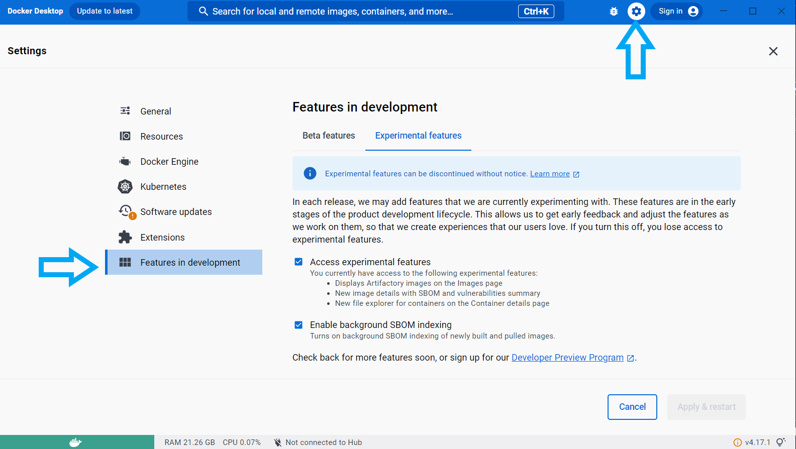

## Computer requirements
- A minimum of 16GB of memory is required. >=32GB is recommended.
- A minimum of 8 CPU cores. 16 are recommended.


## [Install Docker Desktop](https://www.docker.com/products/docker-desktop/)
Docker allows you to run software inside an isolated "container image" on your computer with all of that application's needed dependencies. Make sure to install the version for your operating system.

- [Mac-Intel](https://desktop.docker.com/mac/main/amd64/Docker.dmg?utm_source=docker&utm_medium=webreferral&utm_campaign=dd-smartbutton&utm_location=module)
- [Mac-AppleChip](https://desktop.docker.com/mac/main/arm64/Docker.dmg?utm_source=docker&utm_medium=webreferral&utm_campaign=dd-smartbutton&utm_location=module)


## MIRA Installation

- Open Docker Desktop, and once it is running:

Open Settings -> Features in development -> Experimental Features:

- Ensure "Access Experimental Features" and "Enable backround SBOM Indexing" are both checked on





Next, in __Beta Features__, enable "Use Rosetta for x86/amd66 emulation on Apple Silicon". This will help MIRA run faster and remain more stable


Save these settings by clicking "Apply & restart"


### Open the terminal, and copy/paste these commands ###

```bash
mkdir ~/FLU_SC2_SEQUENCING

cd ~/FLU_SC2_SEQUENCING
```

```bash
curl https://raw.githubusercontent.com/CDCgov/MIRA/prod/docker-compose-git.yml | sed "s%/path/to/data%$(pwd)/%g" > docker-compose.yml
```

```bash
sudo docker-compose up -d
```

You are now running MIRA! You can proceed to [Running MIRA](./running-mira.html)

If these instructions show errors, please refer to our [Troubleshooting](./troubleshooting.html) page