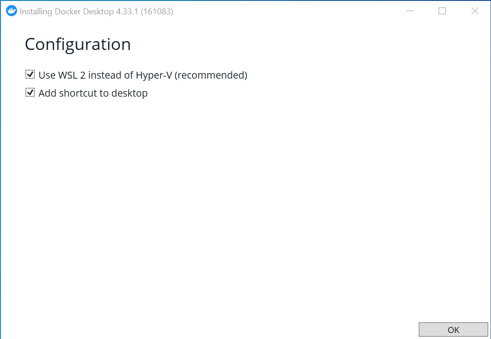
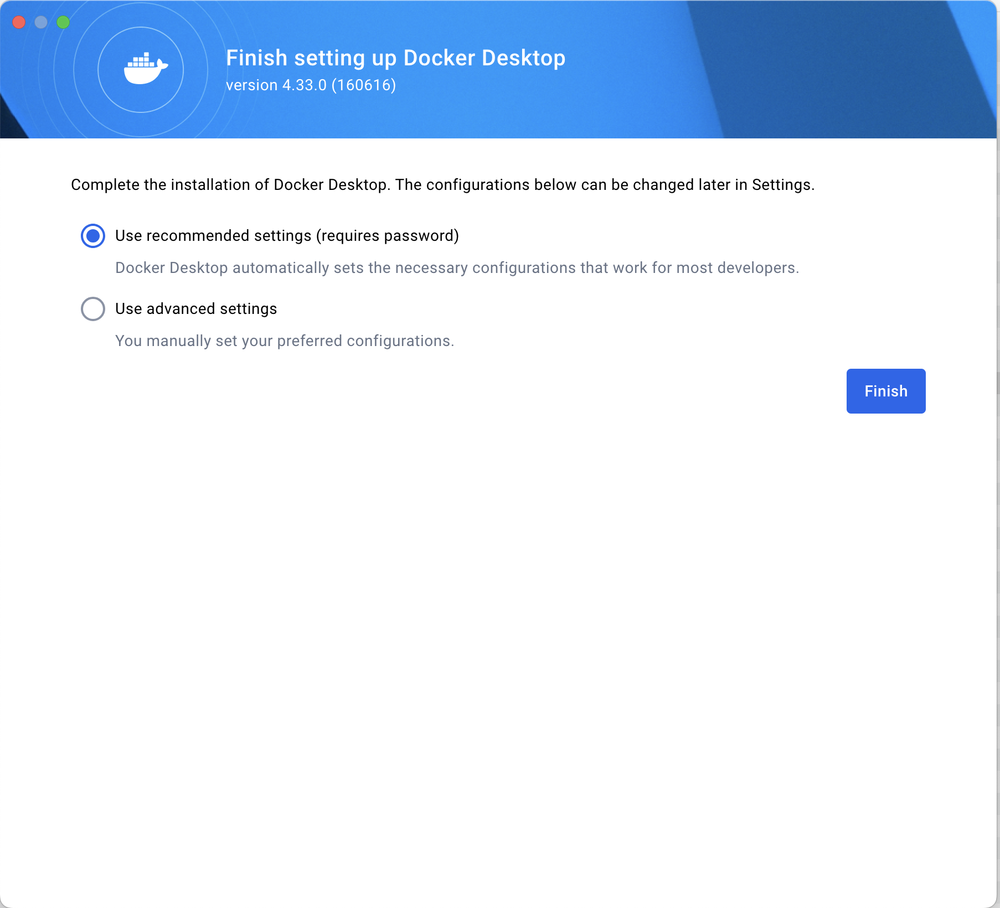
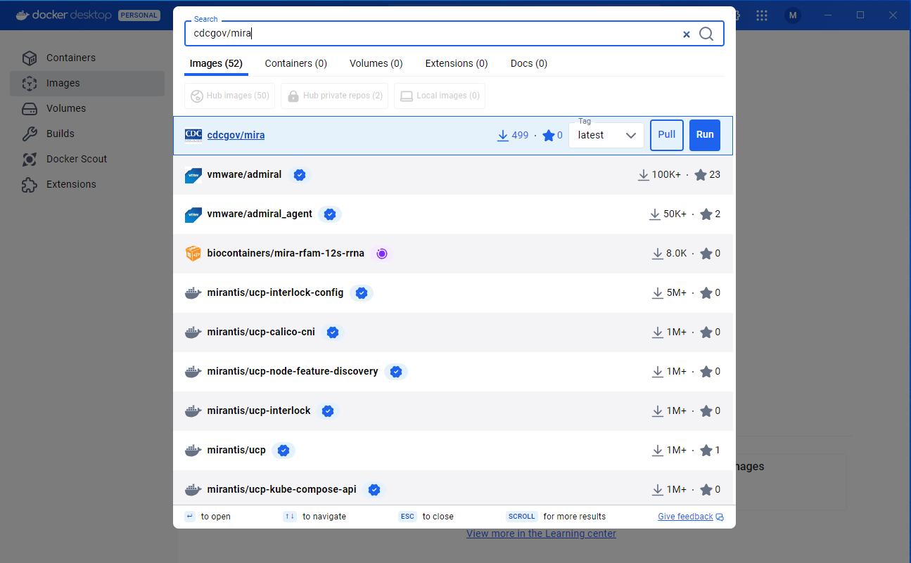
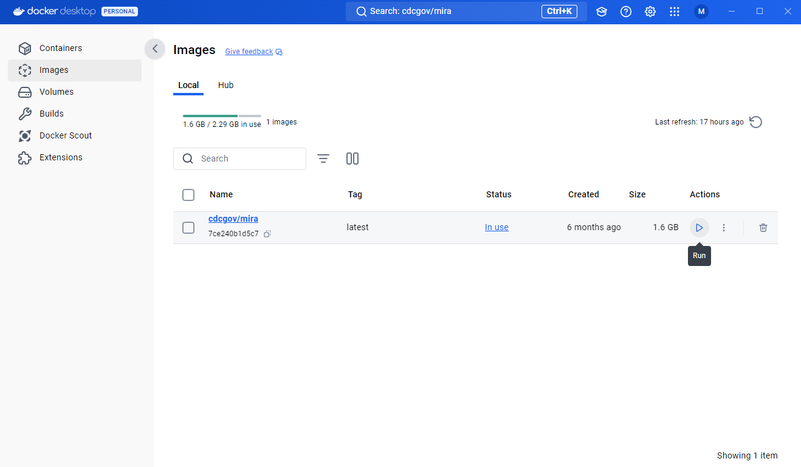
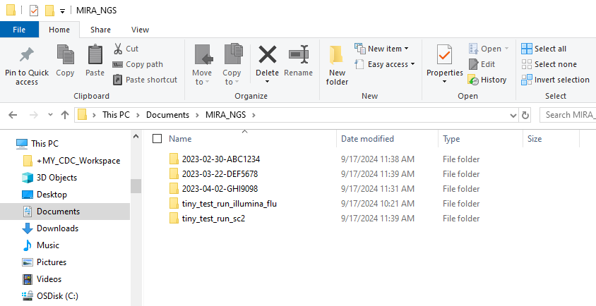
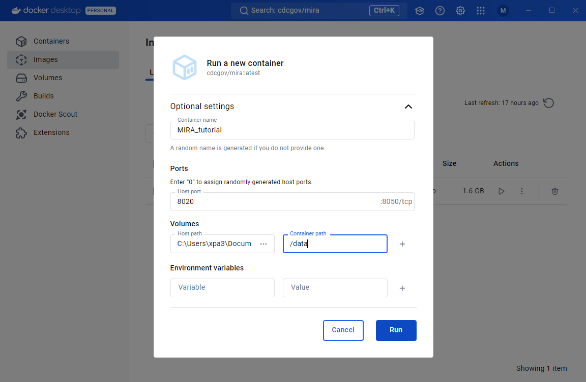
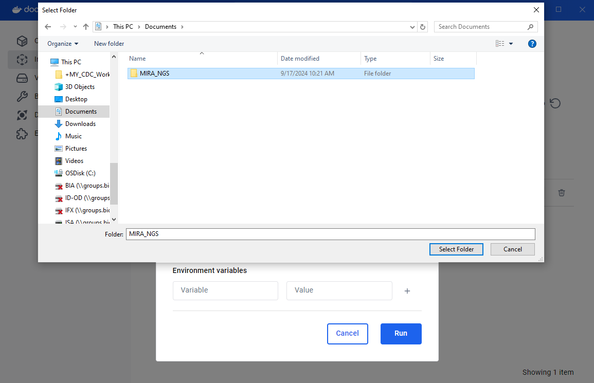

# Running MIRA through Docker Desktop.

## [Install Docker Desktop](https://www.docker.com/products/docker-desktop/)
Docker allows you to run software inside an isolated "container image" on your computer with all of that application's needed dependencies. Make sure to install the version for your operating system.

- [Windows](https://desktop.docker.com/win/main/amd64/Docker%20Desktop%20Installer.exe?utm_source=docker&utm_medium=webreferral&utm_campaign=dd-smartbutton&utm_location=header)
- [Mac-Intel](https://desktop.docker.com/mac/main/amd64/Docker.dmg?utm_source=docker&utm_medium=webreferral&utm_campaign=dd-smartbutton&utm_location=module)
- [Mac-AppleChip](https://desktop.docker.com/mac/main/arm64/Docker.dmg?utm_source=docker&utm_medium=webreferral&utm_campaign=dd-smartbutton&utm_location=module)
- [Linux](https://docs.docker.com/desktop/linux/install/)

After installing Docker Desktop, double click on the app to open it. If it is your first time using Docker Desktop, you will be asked to agree to the terms of use. 

## Setting Up Docker Desktop using PC

When setting up the configuration for a Windows computer, we recommend using WSL 2 on the back-end and adding shortcuts to you desktop. 

## Setting Up Docker Desktop using Mac

When setting up the configuration for a Windows computer, we recommend using the default settings that allow Docker Desktop to automatically set the necessary configuration.

## Pull MIRA Image within Docker Desktop

In the search bar at the top of the Docker Desktop App type in cdcgov/mira. Once the image has come up, check that the tag is set to latest +
and click the 'pull' button.

MIRA's single image is about 3 GB and will take a couple of minutes to pull to youe images area. Once docker has finished downloading the image, you should see under your images tab. 

## Install MIRA Container

In the Documents folder on your computer. Create a folder named "MIRA_NGS". This is where you will put the data that you would like to analyze with MIRA. We will be mounting the container to this folder

In Docker Desktop, navigate to the images tab and press the run button. 

### Provide the Settings for the Container

The container settings should be filled out as seen in the screenshot below.

  

 * You will need to provide a name for the container.
 * Set the "Host Port" to 8020
 * Under Volumes you will provide the file path to the "MIRA_NGS" folder in the "Host Path" box.
  
**There is an option to select the folder via a file browser as shown in the screenshot above**
 * Under Volumes you will make the "Container Path" data.

## Test your MIRA Setup
    
- [Click here to download tiny test data from ONT Influenza genome and SARS-CoV-2-spike - 40Mb](https://centersfordiseasecontrol.sharefile.com/d-s839d7319e9b04e2baba07b4d328f02c2)
- [Click here for the above data set + full genomes of Influenza and SARS-CoV-2 from Illumina MiSeqs - 1Gb](https://centersfordiseasecontrol.sharefile.com/d-s3c52c0b25c2243078f506d60bd787c62)
- unzip the file and find two folders:
    1. `tiny_test_run_flu`
    2. `tiny_test_run_sc2`
- move these folders into `MIRA_NGS`
  - if you cannot find the MIRA_NGS folder in your Linux section of file explorer, look in Linux-->home-->your username

## Next Steps

[Run MIRA in Docker Desktop with Illumina Data](running-mira-dd-illumina.html)

[Run MIRA in Docker Desktop with Oxford Nanopore Data](running-mira-dd-ont.html)