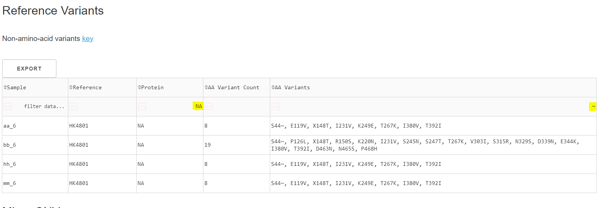
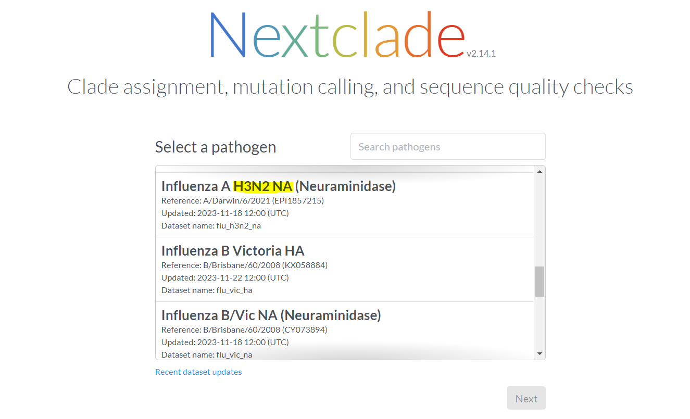
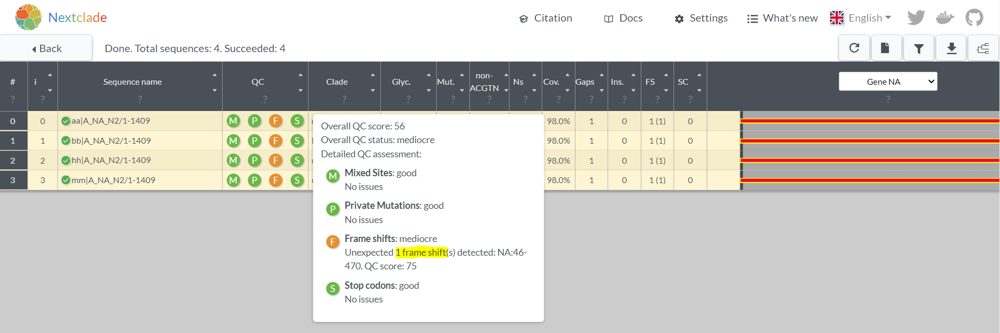
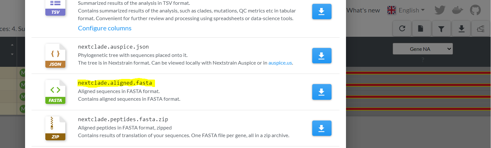
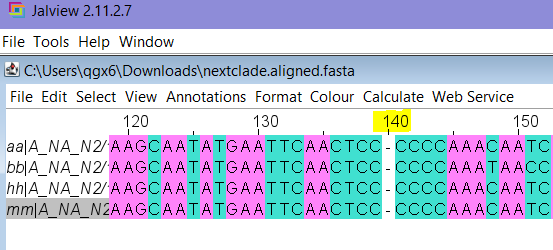
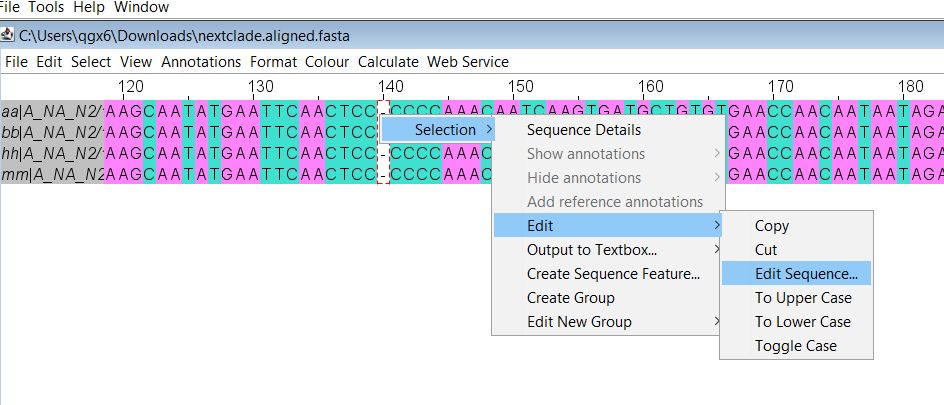
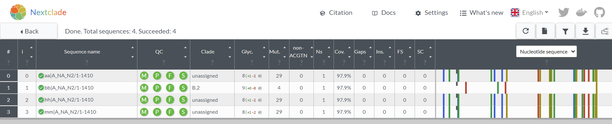

# Correcting Frameshifts in Nanopore MIRA data
Oxford Nanopore data is known to have an increased error rate when calling bases in a homopolymer region.

Ex: if the sequences is AAAAAA, Nanopore might erroneously basecall AAAAA (deleting one A) which can lead to frameshifts in your final assembly data.

The MIRA development team is working on adding features that would auto-correct these homopolymer indels automatically, but in the meantime, here are instructions and examples for manually fixing frameshifts in your data.

We will be using JalView to edit our sequences: https://www.jalview.org/download/ 

## H3N2 NA frameshift correction

At nucleotide position starting 138, H3N2 NA gene has seven Cs in a row. Nanopore is prone to erroneously deleting one of the seven Cs (CC-CCCC).

This corresponds to Amino Acid position 44.

The following is an example of frameshift correction for H3N2 samples with a frameshift at amino acid 44.

#### How to know if my data has a frameshift?
There are a couple of ways to know if your data contains a frameshift.

**1. In MIRA output**

In the reference variants table for your MIRA output, frameshifts are represented by a "~" character. You can specifically filter for instances of "~" by searching in the final column. Here, I searched for "NA" in my protein column and "~" in my AA Variants column to see 4 samples in my run with the frameshift at NA amino acid position 44.

 

**2. In Nextclade output**

If you loaded all of your NA samples to Nextclade, any sequences with a frameshift will be flagged in the output. 
Here is what Nextclade shows for these 4 NA samples (which I called aa, bb, hh, and mm):

- Go to https://clades.nextstrain.org/
- Make sure you select H3N2 NA as your pathogen

 

 

- After you select or input your N2 sequences, if the results show an orange "F" in th QC column, 1 or more in the Gaps column, and a big red bar in the gene section at the far right, then you have a frameshift

**3. Fixing the frameshift with JalView**

- Select the download button in the top right corner of Nextclade's output, and choose the **nextclade.aligned.fasta**

- Open the downloaded .fasta and scroll to the position with the frameshift (if you hover over Gaps in Nextclade, it tells us for these samples, the gap is at nucleotide position 140)

- Since we downloaded the aligned .fasta, we should see a "-" character at position 140 in JalView. Notice all the Cs there? That is our homopolymer:

- TIP: Is your JalView nucleotide size too small and difficult to read? Click Format --> Font --> Size to make it bigger

- Next, we need to "fill" this gap so that it is no longer a frameshift. But since we are missing data, we cannot say for certain that there should be a C here. We just know that there should be a nucleotide. Therefore, we will fill this gap with an N character.

- Select the gap by clicking on the "-", you should see a red box around it. Right click then choose Selection, Edit, then Edit Sequence

- A text box will appear. Replace the "-" with an uppercase "N" and then click OK

- You have successfully filled a frameshift gap! 

- Replace the original sequences in your MIRA multifasta! First, open the original .fasta in Jalview and select the frameshift samples, then type the delete key on your keyboard. Then, you can copy and paste the "fixed" sequence from your nextclade.aligned.fasta JalView window into your MIRA multifasta Jalview window and save.

- Now, when you run Nextclade on the "fixed" sequences, you will see 0 gaps and 0 frameshifts:

