## Running iSpy

_This documentation assumes you have the four required Docker containers (**IRMA**, **DAIS-Ribosome**, **spyne**, and **iSpy**) already running. If not, please start with [setting up containers](#setting-up-containers) instructions._

## Stage your demultiplexed data
1. In your "FLU_SC2_SEQUENCING" folder, make a folder for your run. It is very helpful to name your runs with a consistent naming system, such as "YEAR-MONTH-DATE-FLOWCELL_ID", ie. 2022-11-13-ABC1234. **_DO NOT PUT SPACES OR SLASHES IN YOU RUN FOLDER NAMES!_**
2. Copy the run's demultiplexed fastqs into the RUN-FOLDER.
    1. If this run is from an Oxford Nanopore Technologies' (ONT) sequencer, copy the "fastq_pass" directory from the sequencer's output into the RUN-FOLDER. On a Mk1C instrument, this is found in /data/RUN_NAME/EXPERIMENT_NAME/NANOPORE-NAME/fastq_pass where RUN_NAME and EXPERIMENT_NAME are defined by you in MinKNOW when you set up the sequencing run on the device and the NANOPORE-NAME is created by the instrument during the run.
    2. If this run is from an Illumina instrument, create another folder inside your RUN-FOLDER called "fastqs" and copy the folder containing demultiplexed fastqs into this newly created fastqs folder so that the folder structure is FLU_SC2_SEQUENCING/RUN-FOLDER/fastqs/demultiplexed-fastqs/sample-reads.fastq. There will be two fastq files per sample.

## Run genome assembly with iSpy
1. Open Docker Desktop and navigate to the `Containers` tab on the left sidebar. Assure that the following containers are running or run each of them:
    1. irma-1.0.2p3
    2. dais-ribsome-1.2.1
    3. spyne
    4. iSpy
    
    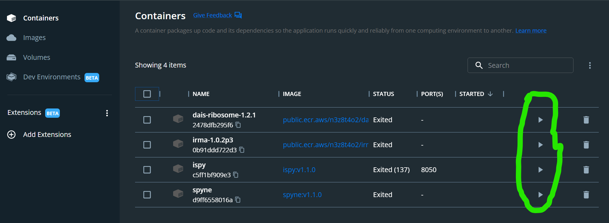
2. Run iSpy by clicking the icon of the box with the arrow pointing to the top left. This will open iSpy into your defa ult internet browser.

    
3. Click the `REFRESH RUN LISTING` button and select your run from  the dropdown box.

    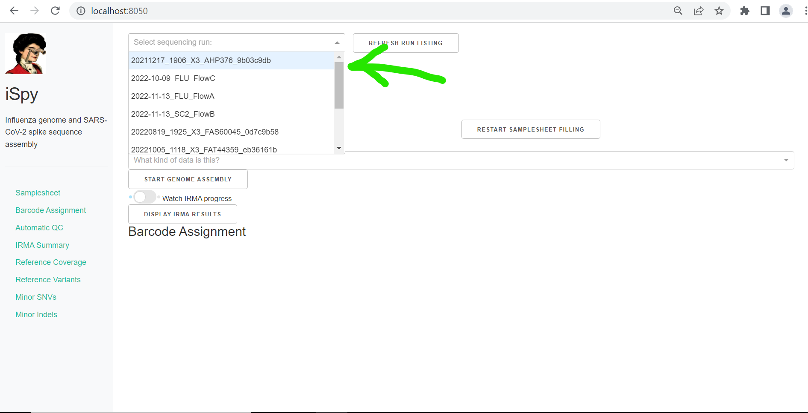

4. Now, enter your `Barcode numbers`. Usually you will be running a simple range of barcode numbers, such as "1-24", but to allow for flexibilty, barcode numbers can be entered in a list combining both single numbers and number-ranges, such as "1-3,5,9,12-20". Now enter your `Sample ID`s. These can be copy and pasted from a column in an excel sheet. Sample names should only be numbers, letters, and underscores ("_"). **Do not use any other characters such as "-" or "/".** Next, select your `Sample Type`. Most of your sample's are test samples, so each row defaults to `test`, but select `- control` or `+ control` for your **negative** and **positive** controls respectively. Finally, select the `Barcode Expansion Pack` you have used during library preparation. CDC's laboratory protocol is currently using "EXP-NBD196".

    - when running tiny_test_run_flu, enter barcode numbers `27,37,41` and make up sample names
    - when running tiny_test_run_sc2, enter barcode numbers `2,3,5,8,28` and make up sample names

    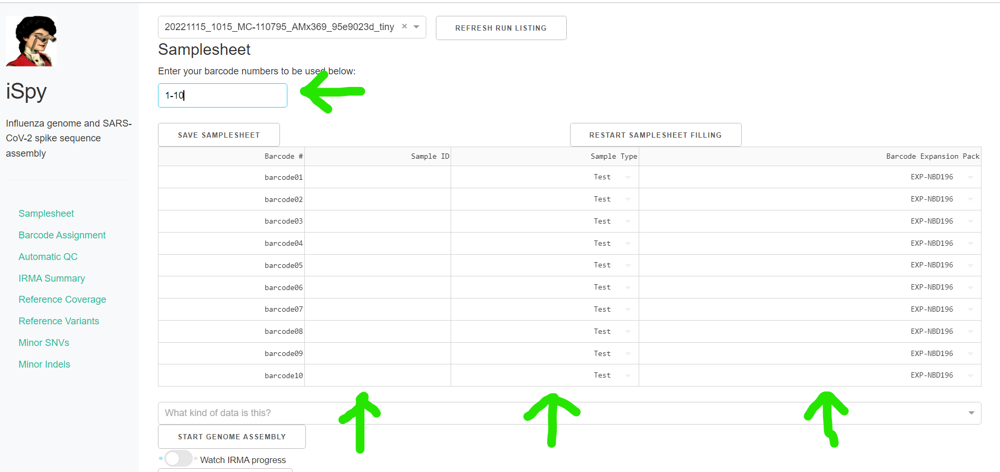

5. Click `SAVE SAMPLESHEET`. _If you need to edit the number of samples/barcodes in your samplesheet after saving, you must click_ `RESTART SAMPLESHEET FILLING` _before editing it._ You will now have to restart filling your samplesheet from the beginning!

    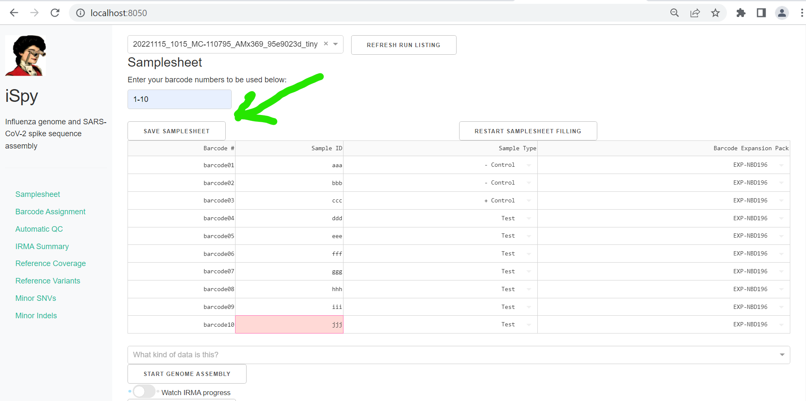

6. Now select the correct data type from the drop down box, `What kind of data is this?` and click `START GENOME ASSEMBLY`. Do not click this button multiple times. Processing will take quite a long time depending on your computers specificatoins and the number of samples you are processing. Now is a good time to go have a coffee. :coffee:

    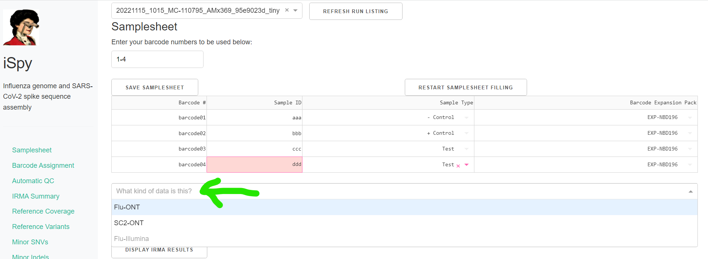

    Click on the toggle button `Watch IRMA Progress`. Assembly will take some time, how long exactly is dependent on your sample number, the number of raw sequencing reads, and the power of your computer.
    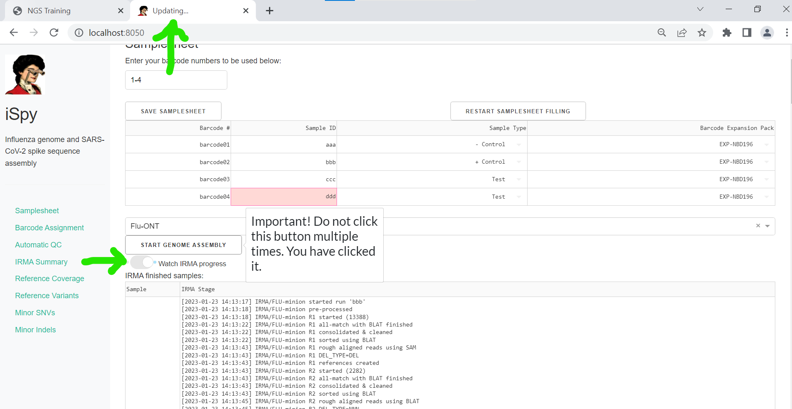

7. When IRMA has finished, "Updating" will no longer be displayed on iSpy's brower tab. Click on `DISPLAY IRMA RESULTS`. You may need to _refresh_ the webpage.

    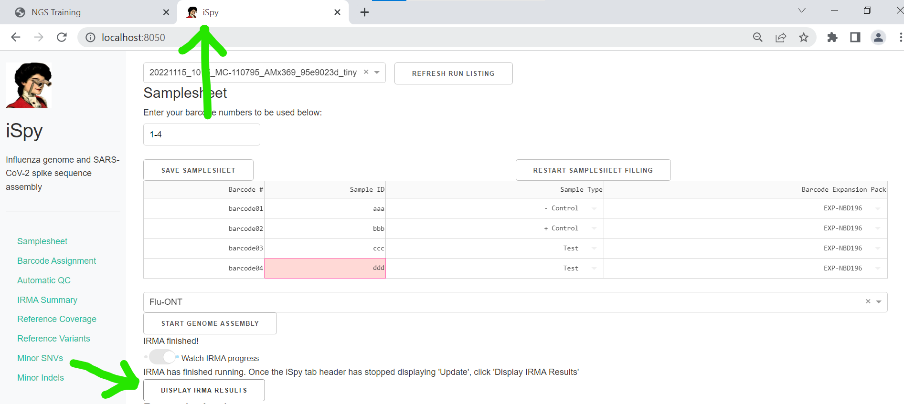

## Review IRMA results

1. Review the distribution of reads assigned to each barcode. The ideal result would be a similar number of reads assigned to each test and positive control. However, it is ok not have similar read numbers per sample. Samples with a low proportion of reads may indicate higher Ct of starting material or less performant PCR during library preparation. What is most important for sequencing assembly is raw count of reads and their quality.

    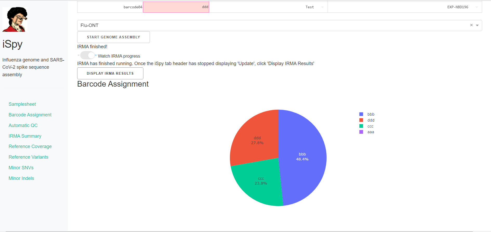

2. Review the "Automatic Quality Control Decisions" heatmap. In addition to IRMA's built in quality control, iSpy requires a minimum mean coverage of 50x, a minimum coverage of reference of 90%, and a maximum number of minor variants >=5% of 10. These are marked in yellow to orange according to the number of these failure types. Samples that failed to generate any assembly are marked in red. In addition, premature stop codons are flagged in yellow. CDC does not submit sequences with premature stop codons, particularly in HA, NA or SARS-CoV-2 Spike. Outside of those genes, premature stop codons near the end of the gene may be ok for submission.

    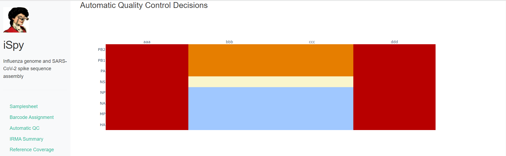

3. Review `Irma Summary`. This summarizes the above information, as well as detailed read assignment to specific referencs, in a table. Click `Export` to save this as an Excel file.

    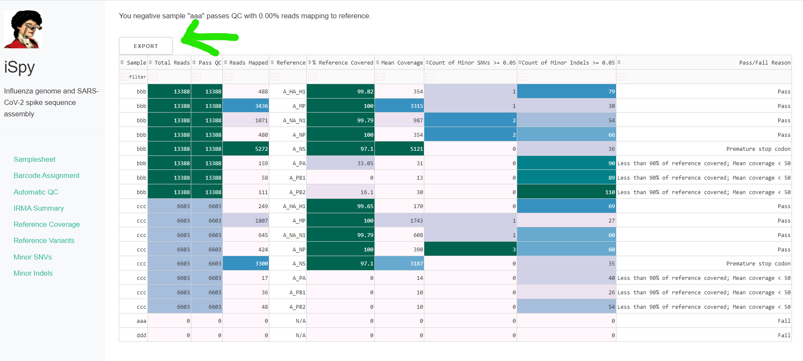

4. Review genome coverage depth. The heatmap summarizes the mean coverage per sample per gene. All the images in iSpy can be interacted with. Play with the gray buttons on the top right of the images. The camera icon will save the image. Clicking on a sample in the heatmap, or selecting one in the drop down menu will display two plots. On the left is a "sankey plot" that shows the number of reads assigned to the barcode, how many of those passed IRMA's QC, and how many are assigned to each gene reference. The plot on the right shows the sample's complete coverage per gene. Try toggling the `log y --- ilnear y` button. In log space, you likely need to reset the view by clicking the gray button in the top right that looks like an X inside of a box. You can also try panning and zooming the plot.

    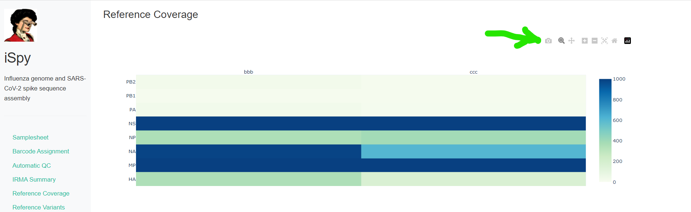
    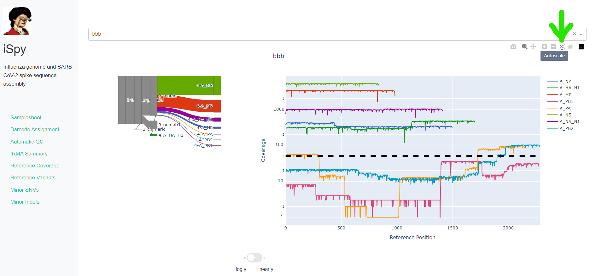

5. Inspect amino acid variants against popular reference sequences.

    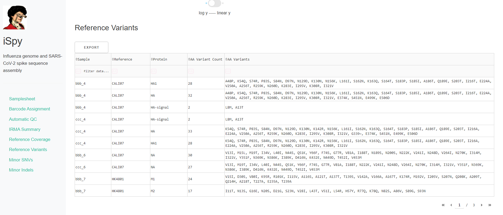

6. Inspect minor variation at single nucleotides, insertions and deletions _relative to the sample's generated consensus sequence._ These tablee are for your own usage and not necessary to review in detail. They can be sorted and filtered and exported to excel sheets for further analyses.

    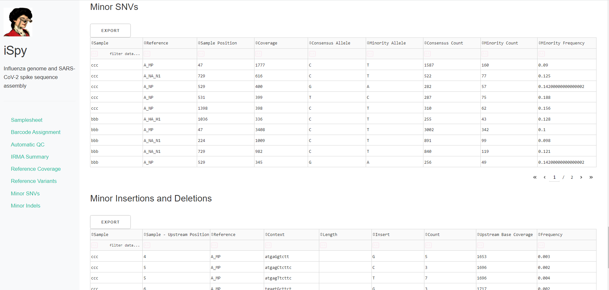

## Save your sequence fasta

- Export IRMA's _amended consensus_ nucleotide sequences and amino acid fasta files. This includes only those passing iSpy's QC criteria and are ready for submission to public databases!

    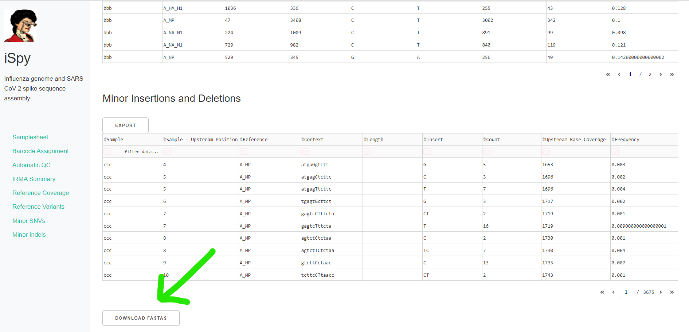

## GISAID: [https://gisaid.org/](https://gisaid.org/)
## NCBI-Genbank: [https://www.ncbi.nlm.nih.gov/genbank/](https://www.ncbi.nlm.nih.gov/genbank/)
## NCBI-BLAST: [https://blast.ncbi.nlm.nih.gov/Blast.cgi](https://blast.ncbi.nlm.nih.gov/Blast.cgi)
## Nextclade: [https://clades.nextstrain.org/](https://clades.nextstrain.org/)

## Getting help

See [FAQs Guide on how to upgrade and remove older versions of iSpy](FAQs.html#how-to-upgrate-or-remove-older-versions-of-ispy-or-other-containers)
