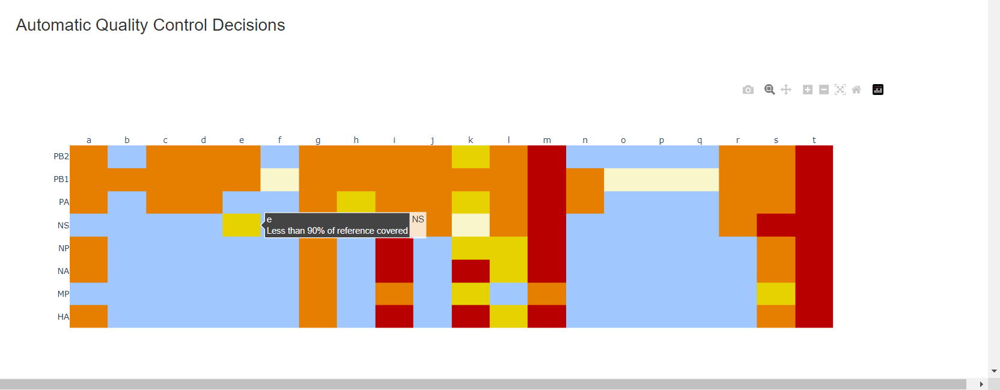
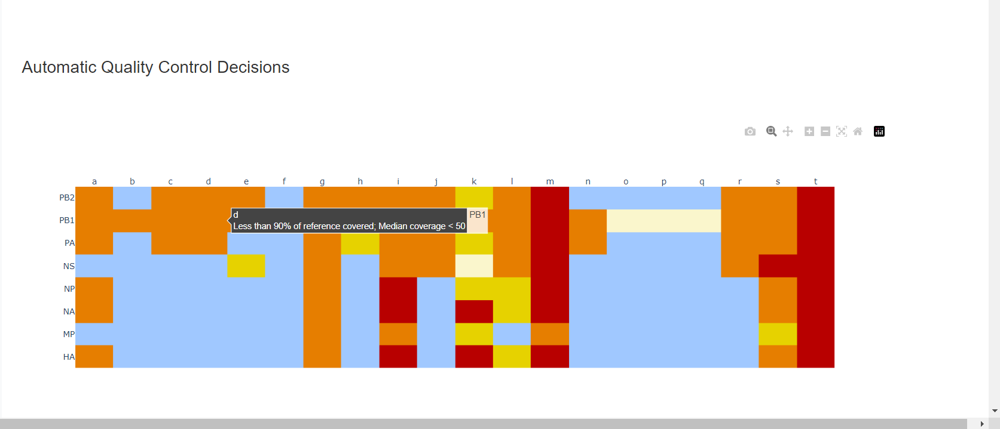
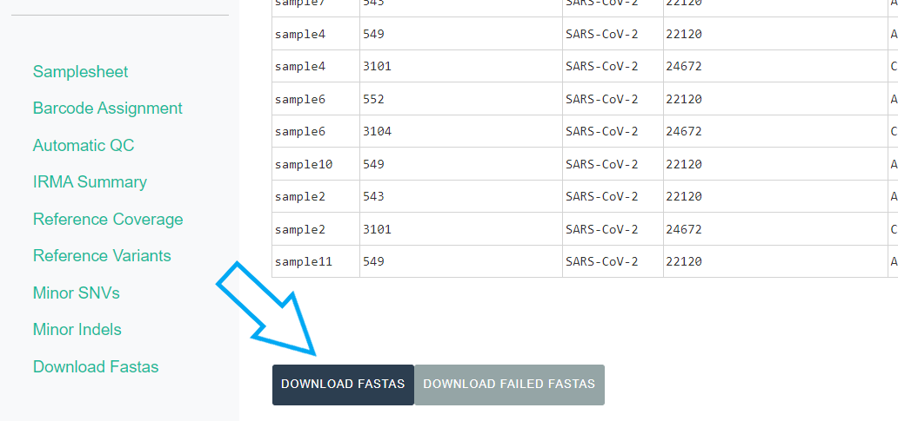

## Running MIRA-CLI with ONT Data


_This documentation assumes you have the MIRA Docker container already running. If not, please start with [getting started](getting-started.html) and [MIRA install](mira-cli-installation.html) instructions._

<hr>
### Fill out Samplesheet

You will need to create your samplesheet.csv before running MIRA-CLI.

The format within the samplesheet should be as follows:

   ```bash
Barcode #,Sample ID,Sample Type
barcode07,s1,Test
barcode37,s2,Test
barcode41,s3,Test
   
   ```
   
* Enter your sample IDs in the "Sample ID" column
    * These can be copy and pasted from a column in another excel sheet. 
    * Sample names should only be numbers, letters, dashes, and underscores ("-" or "_"). **Do not use any other characters such as "/".** 
* Next, select your `Sample Type`. Most of your sample's are test samples, so each row defaults to `test`, but select `- control` or `+ control` for your **negative** and **positive** controls respectively.
* Save your samplesheet with changes as a csv

    

<hr>


## Stage your demultiplexed data

* In your "MIRA_NGS" folder, make a folder for your run. It is very helpful to name your runs with a consistent naming system, such as "YEAR-MONTH-DATE-FLOWCELL_ID", ie. 2022-11-13-ABC1234. 
   
**_DO NOT PUT SPACES OR SLASHES IN YOU RUN FOLDER NAMES!_**


* Copy the run's demultiplexed fastqs into the RUN-FOLDER.
    * Copy the "fastq_pass" directory from the sequencer's output into the RUN-FOLDER. On a Mk1C instrument, this is found in /data/RUN_NAME/EXPERIMENT_NAME/NANOPORE-NAME/fastq_pass where RUN_NAME and EXPERIMENT_NAME are defined by you in MinKNOW when you set up the sequencing run on the device and the NANOPORE-NAME is created by the instrument during the run.
    * For further instruction on data transfer from your MK1C, visit our [data transfer](data-transfer.html) page


<br>
**This screenshot shows WSL distro "Ubuntu-18.04" but many users just see "Ubuntu". This can vary, particularly if you happen to have multiple Ubuntu versions installed. If you have multiple Ubuntu distributions installed, move the fastq_pass to whichever "Ubuntu" contains MIRA_NGS within home>USERNAME>MIRA_NGS**

<hr>

## Run Genome Assembly with MIRA-CLI

### Start the container MIRA container

* If MIRA is running, you should see it listed when you run `docker ps`

Move to the MIRA_NGS folder

   ```bash
    cd ~/MIRA_NGS
   ```
   
To run MIRA in the command line you will execute this command:

   ```bash
    docker exec -w /data mira MIRA.sh -s run_folder/samplesheet.csv -r run_folder -e experiment_type
   ```

Within the command you will change these flags to match your data:

 * s - your_run_folder/samplesheet.csv
 * r - your_run_folder
 * e - Flu-ONT, SC2-Whole-Genome-ONT, SC2-Spike-Only-ONT, RSV-ONT
 
There will be a lot of standard error messages that print while MIRA is running. It will look like the picture below:


### MIRA-CLI Ouputs

After MIRA has successfully completed its analysis, the following outputs should be within the run folder regardless of the experiment type indicated:


 **Note that files are named with the name given to the run folder**
 
 If you open the MIRA-summary HTML it will look very similar to the summary provided in the GUI. It contains many of the same summary figures. To view the outputs in the MIRA GUI see [below](https://cdcgov.github.io/MIRA/running-mira-cli-ont#view-results-in-mira-gui)
 
 
 
 **For all of the download links to work within the MIRA-summary HTML, it must have the other files that were created with it in the same directory (e.g. the amended_consensus.fasta, minorvariants.xlsx, etc.).**
 
Key differences between the summary html and the summary in the GUI:
 
  * There are only individual coverage files present for download.
  * The minor variants and indels tables are only available for download. 

FASTA files:

 * amended_consensus.fasta - Nucleotide sequences that passed QC
 * failed_amended_consensus.fasta - Nucleotide sequences that did not pass QC
 * amino_acid_consensus.fasta - Amino acid sequences that passed QC
 * failed_amino_acid_consensus.fasta - Amino acid sequences that did not pass QC
 
Excel files:

 * aavars.xlsx - The amino acids variant table. If you see special characters or frameshifts [see below](https://cdcgov.github.io/MIRA/articles/running-mira-cli-ont.html#special-translated-characters)
 * minorvariants.xlsx - The single nucleotide variants (minor SNVs) table
 * minorindels.xlsx - The minor insertions and deletions table
 * summary.xlsx - This summaries the coverage stats from the IRMA assemblies, QC information determined by IRMA and read count information.
 
There will also be individual coverage HTML files for each sample that was give to MIRA for analysis.

The IRMA folder contains the [IRMA](https://wonder.cdc.gov/amd/flu/irma/irma.html) assemblies and full output with each sample getting its own folder. There will also be a folder within the IRMA folder label 'dais_results' that contains the inputs and output from [DAIS Ribsome](https://hub.docker.com/r/cdcgov/dais-ribosome). The subsampled (and trimmed if applicable) fastq files will also be stored within this folder. We summarize all the information found in these folder in the reports listed above.

The dash-json folder contains all of the json files from which the GUI builds it's figures. We recommend that you keep these files as they contain the key results from your analysis. See below for more information about the [file archival process](https://cdcgov.github.io/MIRA/running-mira-cli-ont#archiving-files)


## View Results in MIRA-GUI

* Open MIRA by clicking the blue link "8020:8050". This will open MIRA into your default internet browser. You can "bookmark" this site in your browser.
 
    

### Select runs, data type, and enter sample information

* Click the `REFRESH RUN LISTING` button and select your run from  the dropdown box.

    

  *Next, click the box that say "What kind of data is this" and select the data type you used for analysis

  

After filling out those fields you should see your samplesheet in the GUI.

  


It will also say "IRMA is finished" and you can now click on "DISPLAY IRMA RESULTS".

 

<hr>

### Review IRMA results

1. Review the distribution of reads assigned to each barcode. The ideal result would be a similar number of reads assigned to each test and positive control. However, it is ok to not have similar read numbers per sample. Samples with a low proportion of reads may indicate higher Ct of starting material or less performant PCR during library preparation. What is most important for sequencing assembly is raw count of reads and their quality.

    

2. Review the "Automatic Quality Control Decisions" heatmap. In addition to IRMA's built in quality control, MIRA requires a minimum median coverage of 50x, a minimum coverage of the reference length of 90%, and checks for minor variant counts indicative of contamination. See our [QC standars page](sequence-qc.html) for all thresholds. These are marked in yellow to orange according to the number of these failure types. Samples that failed to generate any assembly are marked in red. In addition, premature stop codons are flagged in yellow. CDC does not submit sequences with premature stop codons, particularly in HA, NA or SARS-CoV-2 Spike. Outside of those genes, premature stop codons near the end of the gene may be ok for submission. Hover your mouse over the figure to see individual results.

    | | |
    |--|--|
    |||
    |||
    |--|--|

3. Review `MIRA Summary`. This summarizes the above information, as well as detailed read assignment to specific referencs, in a table. Columns can be sorted and filtered, ie. `>1000`. Click `Export` to save this as an Excel file.

    

4. Review genome coverage depth. The heatmap summarizes the mean coverage per sample per gene. For all MIRA figures, you can be click the gray buttons on the top right of the images. The camera icon will save the image. Clicking on a sample in the heatmap, or selecting one in the drop down menu will display two plots. On the left is a "sankey plot" that shows the number of reads assigned to the barcode, how many of those passed IRMA's QC, and how many are assigned to each gene reference. The plot on the right shows the sample's complete coverage per gene. Try toggling the `log y --- linear y` button. In log space, you likely need to reset the view by clicking the gray button in the top right that looks like an X inside of a box. You can also try panning and zooming the plot.

    
    
    
    


5. Inspect amino acid variants against popular reference sequences.

    

Here, you may see some mutations that do not match Amino Acid letters.

### Special translated characters
Translation produces standard amino acid codes with the two non-standard exceptions (. and ~) listed below.  The translation engine stops when it encounters a stop codon, but corrects itself to continue in-frame when a frameshift is encountered.


```{css, echo=FALSE}
th {
  font-weight: bold;
}

th, td {
  border: 1px solid black
}
```


<table>
<tr>
<th>Character</th>
<th>Interpretation</th>
</tr>
<tr>
<td>.</td>
<td>Missing alignment data</td>
</tr>
<tr>
<td>-</td>
<td>Gap in alignment (ex: deletion)</td>
</tr>
<tr>
<td>~</td>
<td>Partial codon (ex: frameshift)</td>
</tr>
<tr>
<td>X</td>
<td>Ambiguous codon translation</td>
</tr>
</table>

<br>

If you have frameshifts in your data, [click here](./nanopore-frameshift-correction.Rmd) for instructions on how to fix them

6. Inspect minor variation at single nucleotides, insertions and deletions _relative to the sample's generated consensus sequence._ These tables are for your own usage and not necessary to review in detail. They can be sorted and filtered and exported to excel sheets for further analyses.

    
    * Minor variants greater than 5% frequency are shown
    * Indels greater than 20% frequency are shown

<hr>

### Save your sequences in a fasta file

- Export IRMA's _amended consensus_ nucleotide sequences and amino acid fasta files. This includes only those passing MIRA's QC criteria and are ready for submission to public databases!

    
    * The `DOWNLOAD FASTAS` button will only return passing samples. To investigate failed sequences, click the `DOWNLOAD FAILED FASTAS` button. Do not submit failed samples to public repositories!
    
    * You can open and view these Amino Acid and Nucleotide fastas in any sequence viewing application
    

<hr>

## Archiving Files

Files that we recommend keeping:

 * The original raw FASTQ files and the samplesheet.csv.
 * All files within the dash-json folder.
 * The amended consensus fasta files
 
**You should keep any of the fasta files, excel files or html files described [above](https://cdcgov.github.io/MIRA/running-mira-cli-ont#mira-cli-outputs) that you believe will be useful to you.**
 
 Files that can be discarded:
 
  * The IRMA folder and all of it's contents.
  * The logs folder and all of it's contents.
  * The .snakemake folder and all of it's contents
  * Any .fin files
  

<hr>
<hr>
### Wow! You are doing such great work. Time to share your sequences with the world by uploading to GISAID and/or NCBI and to start analyzing your own data!
- GISAID: [https://gisaid.org/](https://gisaid.org/)
    - Please indicate in your GISAID submission "MIRA" for the `assembly method` metadata field
- NCBI-Genbank: [https://www.ncbi.nlm.nih.gov/genbank/](https://www.ncbi.nlm.nih.gov/genbank/)
- NCBI-BLAST: [https://blast.ncbi.nlm.nih.gov/Blast.cgi](https://blast.ncbi.nlm.nih.gov/Blast.cgi)
- Nextclade: [https://clades.nextstrain.org/](https://clades.nextstrain.org/)
