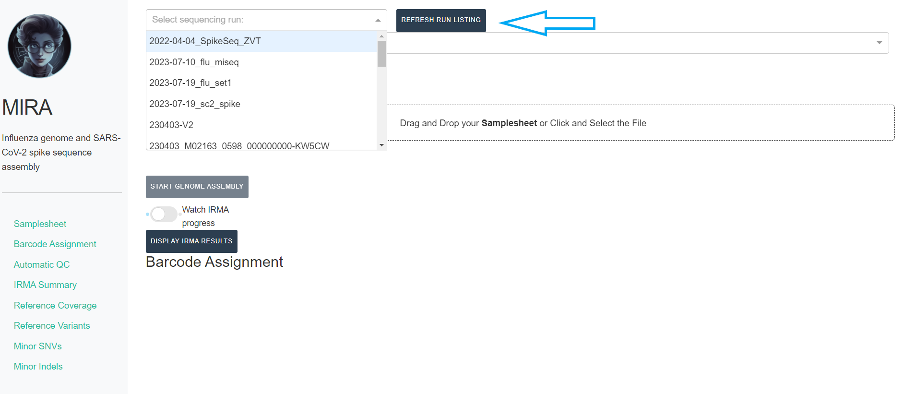
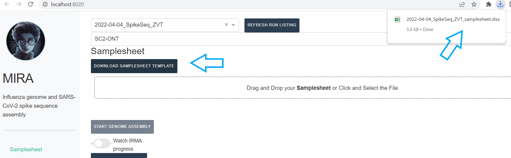
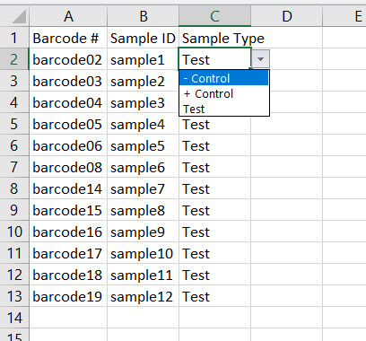
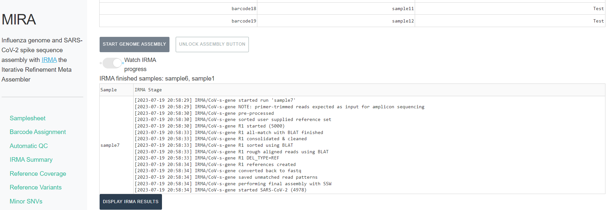

## Running MIRA with Oxford Nanopore Data


_This documentation assumes you have the four required Docker containers (**IRMA**, **DAIS-Ribosome**, **spyne**, and **MIRA**) already running. If not, please start with [getting started](getting-started.html) and [MIRA install](mira-installation.html) instructions._

<hr>

## Stage your demultiplexed data
* In your "FLU_SC2_SEQUENCING" folder, make a folder for your run. It is very helpful to name your runs with a consistent naming system, such as "YEAR-MONTH-DATE-FLOWCELL_ID", ie. 2022-11-13-ABC1234. 
   
**_DO NOT PUT SPACES OR SLASHES IN YOU RUN FOLDER NAMES!_**


* Copy the run's demultiplexed fastqs into the RUN-FOLDER.
    * Copy the "fastq_pass" directory from the sequencer's output into the RUN-FOLDER. On a Mk1C instrument, this is found in /data/RUN_NAME/EXPERIMENT_NAME/NANOPORE-NAME/fastq_pass where RUN_NAME and EXPERIMENT_NAME are defined by you in MinKNOW when you set up the sequencing run on the device and the NANOPORE-NAME is created by the instrument during the run.


<br>
**This screenshot shows "Ubuntu-18.04" but many users just see "Ubuntu". This can vary, particularly if you happen to have multiple Ubuntu versions installed. If you have multiple Ubunut distributions installed, move the fastqs to whichever "Ubuntu" contains FLU_SC2_SEQUENCING within home>USERNAME>FLU_SC2_SEQUENCING**

<hr>

## Run genome assembly with MIRA
### Start the containers
* Open Docker Desktop and navigate to the `Containers` tab on the left sidebar. Assure that the following containers are running or run each of them:
    1. irma
    2. dais
    3. spyne
    4. MIRA

### Open MIRA    
* Run MIRA by clicking the blue link "8020:8050". This will open MIRA into your default internet browser. You can "bookmark" this site in your browser.
 
    

### Select runs, data type, and enter sample information
* Click the `REFRESH RUN LISTING` button and select your run from  the dropdown box.

    

    * Next, click the box that say "What kind of data is this" and select Flu-ONT, SC2-Whole-Genome-ONT, or SC2-Spike-Only-ONT


    

* Next, click `DOWNLOAD SAMPLESHEET TEMPLATE` and open the resulting Excel spreadsheet
    
    
    
* Your `Barcode numbers` column will be inferred from the fastq_pass folder inside of your run folder.     
    * If you do not see a barcode that you expect, this is because that barcode does not have a fastq to process. 
* Enter your sample IDs in the "Sample ID" column
    * These can be copy and pasted from a column in another excel sheet. 
    * Sample names should only be numbers, letters, dashes, and underscores ("-" or "_"). **Do not use any other characters such as "/".** 
* Next, select your `Sample Type`. Most of your sample's are test samples, so each row defaults to `test`, but select `- control` or `+ control` for your **negative** and **positive** controls respectively. 

    

* Save your samplesheet with changes in Excel

* Back in MIRA, Click the "Drag and Drop your Samplesheet" to select your filled-in samplesheet. 
    * A table in the application should now appear with your samples!

    

### Start Genome Assembly
* Now select `UNLOCK ASSEMBLY BUTTON` and click `START GENOME ASSEMBLY`. Now is a good time to go have a coffee. 

    * Click on the toggle button `Watch IRMA Progress`. Assembly will take some time, how long exactly is dependent on your sample number, the number of raw sequencing reads, and the power of your computer.
    
    * as IRMA completes assembly on each sample, they will be listed at the top of the progress indicator


* When IRMA has finished, it will say "IRMA is finished" and you can now click on "DISPLAY IRMA RESULTS".

    

<hr>

## Review IRMA results

1. Review the distribution of reads assigned to each barcode. The ideal result would be a similar number of reads assigned to each test and positive control. However, it is ok to not have similar read numbers per sample. Samples with a low proportion of reads may indicate higher Ct of starting material or less performant PCR during library preparation. What is most important for sequencing assembly is raw count of reads and their quality.

    

2. Review the "Automatic Quality Control Decisions" heatmap. In addition to IRMA's built in quality control, MIRA requires a minimum median coverage of 50x, a minimum coverage of the reference length of 90%, and less than 10 minor variants >=5%. These are marked in yellow to orange according to the number of these failure types. Samples that failed to generate any assembly are marked in red. In addition, premature stop codons are flagged in yellow. CDC does not submit sequences with premature stop codons, particularly in HA, NA or SARS-CoV-2 Spike. Outside of those genes, premature stop codons near the end of the gene may be ok for submission. Hover your mouse over the figure to see individual results.

    | | |
    |--|--|
    |||
    |||
    |--|--|

3. Review `Irma Summary`. This summarizes the above information, as well as detailed read assignment to specific referencs, in a table. Columns can be sorted and filtered, ie. `>1000`. Click `Export` to save this as an Excel file.

    

4. Review genome coverage depth. The heatmap summarizes the mean coverage per sample per gene. All the images in MIRA can be interacted with. Click the gray buttons on the top right of the images. The camera icon will save the image. Clicking on a sample in the heatmap, or selecting one in the drop down menu will display two plots. On the left is a "sankey plot" that shows the number of reads assigned to the barcode, how many of those passed IRMA's QC, and how many are assigned to each gene reference. The plot on the right shows the sample's complete coverage per gene. Try toggling the `log y --- linear y` button. In log space, you likely need to reset the view by clicking the gray button in the top right that looks like an X inside of a box. You can also try panning and zooming the plot.

    
    
    
    


5. Inspect amino acid variants against popular reference sequences.

    

Here, you may see some mutations that do not match Amino Acid letters.

### Special translated characters
Translation produces standard amino acid codes with the two non-standard exceptions (. and ~) listed below.  The translation engine stops when it encounters a stop codon, but corrects itself to continue in-frame when a frameshift is encountered.


```{css, echo=FALSE}
th {
  font-weight: bold;
}

th, td {
  border: 1px solid black
}
```


<table>
<tr>
<th>Character</th>
<th>Interpretation</th>
</tr>
<tr>
<td>.</td>
<td>Missing alignment data</td>
</tr>
<tr>
<td>-</td>
<td>Gap in alignment (ex: deletion)</td>
</tr>
<tr>
<td>~</td>
<td>Partial codon (ex: frameshift)</td>
</tr>
<tr>
<td>X</td>
<td>Ambiguous codon translation</td>
</tr>
</table>

<br>

6. Inspect minor variation at single nucleotides, insertions and deletions _relative to the sample's generated consensus sequence._ These tables are for your own usage and not necessary to review in detail. They can be sorted and filtered and exported to excel sheets for further analyses.

    
    * Minor variants greater than 5% frequency are shown
    * Indels greater than 20% frequency are shown

<hr>

## Save your sequences in a fasta file

- Export IRMA's _amended consensus_ nucleotide sequences and amino acid fasta files. This includes only those passing MIRA's QC criteria and are ready for submission to public databases!

    
    * The `DOWNLOAD FASTAS` button will only return passing samples. To investigate failed sequences, click the `DOWNLOAD FAILED FASTAS` button. Do not submit failed samples to public repositories!
    
    * You can open and view these Amino Acid and Nucleotide fastas in any sequence viewing application
    


<hr>
<hr>
### Wow! You are doing such great work. Time to share your sequences with the world by uploading to GISAID and/or NCBI and to start analyzing your own data!
- GISAID: [https://gisaid.org/](https://gisaid.org/)
- NCBI-Genbank: [https://www.ncbi.nlm.nih.gov/genbank/](https://www.ncbi.nlm.nih.gov/genbank/)
- NCBI-BLAST: [https://blast.ncbi.nlm.nih.gov/Blast.cgi](https://blast.ncbi.nlm.nih.gov/Blast.cgi)
- Nextclade: [https://clades.nextstrain.org/](https://clades.nextstrain.org/)
