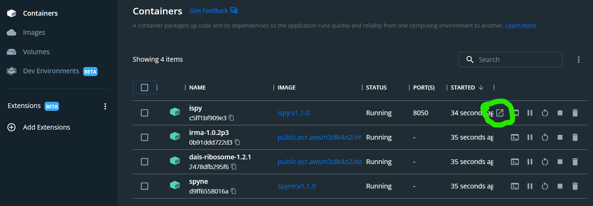

# Setting up containers

iSpy relies on four Docker **_containers_** to run, each of which must be installed using the `docker pull` command inside Linux or Mac Terminal to download the docker **_images_** from the Quay.io repository (IRMA and DAIS-Ribosome are presently stored in AWS's ECR). These **_images_** are then built into runnable **_containers_** with the `docker run` command.

If using a Windows PC, you should have already installed WSL2, Docker Desktop, **and** Docker CLI inside WSL2. If you have not, [please return to those instructions.](getting-started.html)

1. Open an Ubuntu or Mac Terminal
2. Pull the container for our genome assembler: [IRMA](https://wonder.cdc.gov/amd/flu/irma/)

    ```bash
    docker pull public.ecr.aws/n3z8t4o2/irma:1.0.2p3
    ```
    
    - if you see a "Permission Denied" error, try to rerun with sudo before "docker pull" <br><br>
    
3. Pull the container for our genome annotator: DAIS-Ribosome

    ```bash
    docker pull public.ecr.aws/n3z8t4o2/dais-ribosome:1.2.1
    ```
    
4. Pull the container for iSpy's backend "spyne" [Snakemake workflow manager](https://snakemake.readthedocs.io/en/stable/)

    ```bash
    docker pull quay.io/nbx0_cdc/spyne:v1.1.1
    ```
    
5. Pull the container for iSpy

    ```bash
    docker pull quay.io/nbx0_cdc/ispy:v1.1.0
    ```
    
6. Create a folder inside Ubuntu that will store your sequencing runs' data.

    ```bash
    mkdir ~/FLU_SC2_SEQUENCING
    ```
    
    - **_Optional:_** Navigate to `File Explorer` and find this folder inside the Ubuntu mount on the left sidebar. Click on this folder to open its contents and then open `home` and then open the folder named for your WSL _username_. Right click "FLU_SC2_SEQUENCING" and `Create Shortcut`. Move the shortcut folder to a memorable location such as your Desktop. <br><br>

7. Build the IRMA container

    ```bash
    docker run -v $(readlink -f ~/FLU_SC2_SEQUENCING):/data --name irma-1.0.2p3 -t -d public.ecr.aws/n3z8t4o2/irma:1.0.2p3
    ```
    
8. Build the DAIS-Ribosome container

    ```bash
    docker run -v $(readlink -f ~/FLU_SC2_SEQUENCING):/data --name dais-ribosome-1.2.1 -t -d public.ecr.aws/n3z8t4o2/dais-ribosome:1.2.1
    ```
    
9. Build the spyne container

    ```bash
    docker run -v $(readlink -f ~/FLU_SC2_SEQUENCING):/data -v /var/run/docker.sock:/var/run/docker.sock --name spyne -t -d quay.io/nbx0_cdc/spyne:v1.1.1
    ```
    
10. Build the iSpy container

    ```bash
    docker run -v $(readlink -f ~/FLU_SC2_SEQUENCING):/data -v /var/run/docker.sock:/var/run/docker.sock -d -p 8050:8050 --name ispy quay.io/nbx0_cdc/ispy:v1.1.0
    ```
    
11. _Optional :_ [Download test data here](https://centersfordiseasecontrol.sharefile.com/d-sb2d3b06e9ef946cf89e1a43c5a141a3f)
    - unzip the file and find two folders
        - tiny_test_run_flu
        - tiny_test_run_sc2
    - move these folders into ~/FLU_SC2_SEQUENCING
    - when you `Refresh Run Listing` in iSpy, you should now see these folders listed
    - when running tiny_test_run_flu, enter barcode numbers `27,37,41` and make up sample names.
    - when running tiny_test_run_sc2, enter barcode numbers `2,3,5,8,28` and make up sample names.
    
You are now ready to run iSpy! You can open it from `Docker Desktop` by clicking on the `Containers` tab on the left sidebar and clicking the icon of the box with the arrow pointing to the top left. This will open iSpy into your default internet browser.




