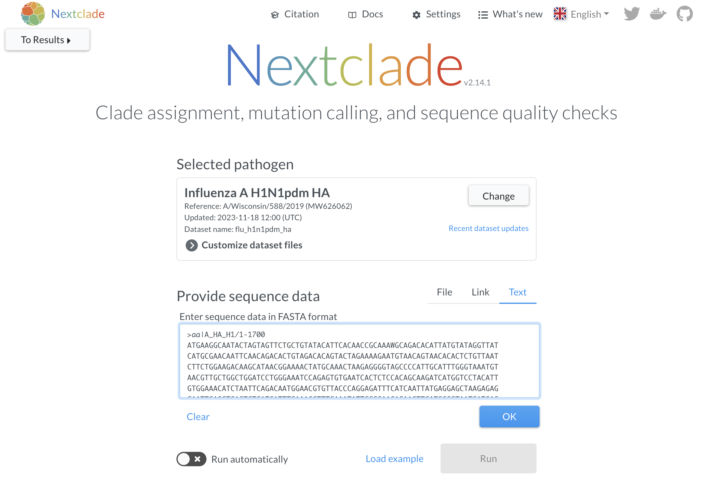

# [Post-MIRA consensus sequence analysis practical](./training-post-mira.html)
# _Answers_

## Flu
1.

2.

3. Sample "aa" has the fewest reads with 5830 reads that represent 10.7% of all assigned reads.

4. The negative control passes with 0.00% reads mapping to flu.

5. The most common reason that segments fail quality control is because they do not have more than 90% of the reference segment covered.

    |Failure reason|Sample:(Segments)|
    |-|-|
    |Less than 90% of reference covered|aa:(PB2,PB1,PA); bb:(PB2,PB1,PA); cc:(PB1)|
    |Median coverage < 50x|aa:(PB2,PB1,PA);bb:(PB2)|
    |Premature stop codon|aa:(NS); bb:(PB1)|

6. 
|Barcode|ID|Subtype|
|-|-|-|
|barcode31|aa|H1N1|
|barcode38|bb|H1N2|
|barcode41|cc|H3N2|
|barcode44|NTC-1||

7.  [X means this is an ambiguous amino acid](https://cdcgov.github.io/MIRA/articles/running-mira.html#special-translated-characters). 

That means this is either a mixed-base position in the codon leading to multiple amino acids, or as in this case, 
the base call is missing and marked as an "N" in the consensus sequence. These positions are called as "N" because 
they do not meet the minimum 50x coverage needed to get a base call that we are confident in.
Because >90% of the reference is sequenced, this data is still considered useful and can be uploaded into GISAID/NCBI.

    _The dip in sequencing coverage between HA position 518-715 is likely due to defective interfering particles [(DIPs)](https://www.mdpi.com/1999-4915/14/12/2773) in this sample. This is commonly seen in influenza viruses that are overgrown in tissue culture. When the segment is amplified, the truncated segments are preferentially amplified so you end up with a coverage diagram showing increased coverage at both or either end of the segment as compared to the center regions._

    

8. Sites with minor variants >= 20% will be called as the [IUPAC mixed bases](https://www.bioinformatics.org/sms/iupac.html).  

9.

10.

11. H1N1 and H3N2

12. A/Wisconsin/588/2019

13..

14. There is a frameshift beginning at position 1087.

15.

16. 23

17.

18.

19. swine

Clicking on "Distance tree of results" will show you a phylogenetic tree with the top hits and the query sequence.

# SC2

|Barcode|ID|WHO-clade|Nextclade-pango-clade|
|-|-|-|-|
|barcode02|NTC-1|||
|barcode05|aa||A.1|
|barcode11|bb|recombinant|XD|
|barcode19|cc|Delta|AY.4|
|barcode22|dd|Omicron|XBB.1.5|

