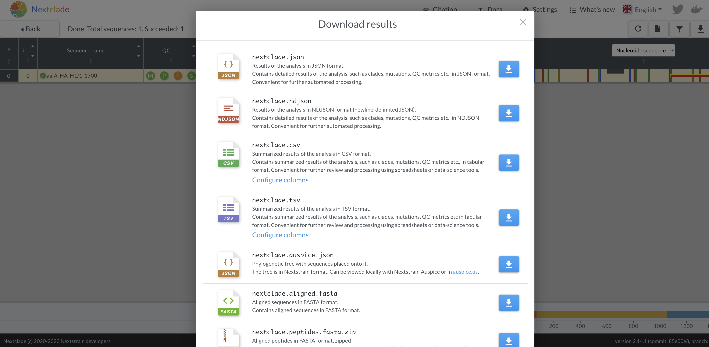
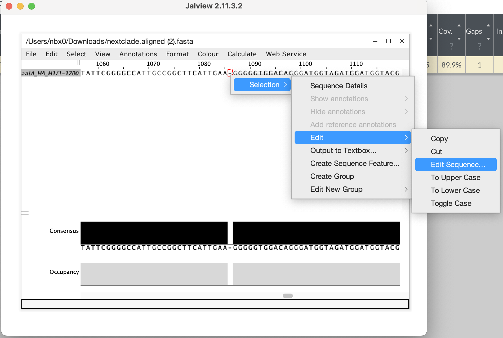
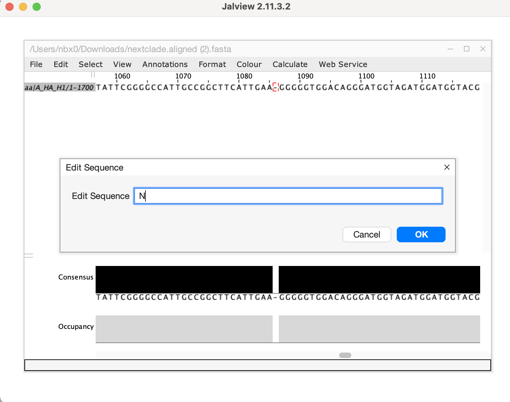
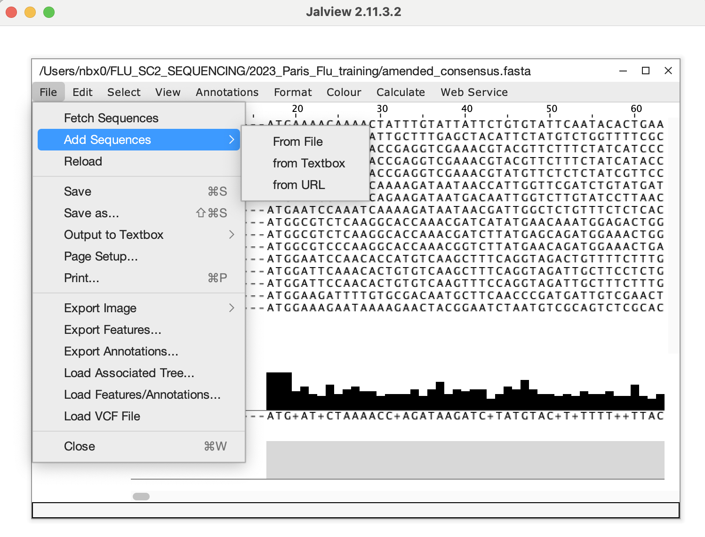
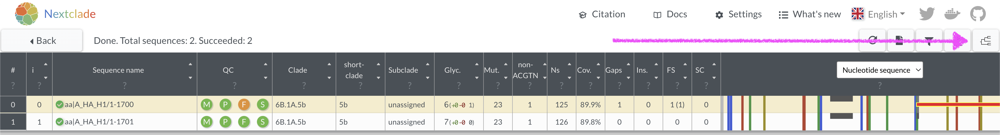
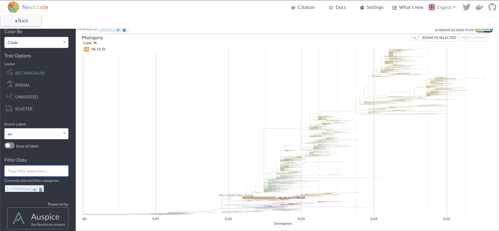
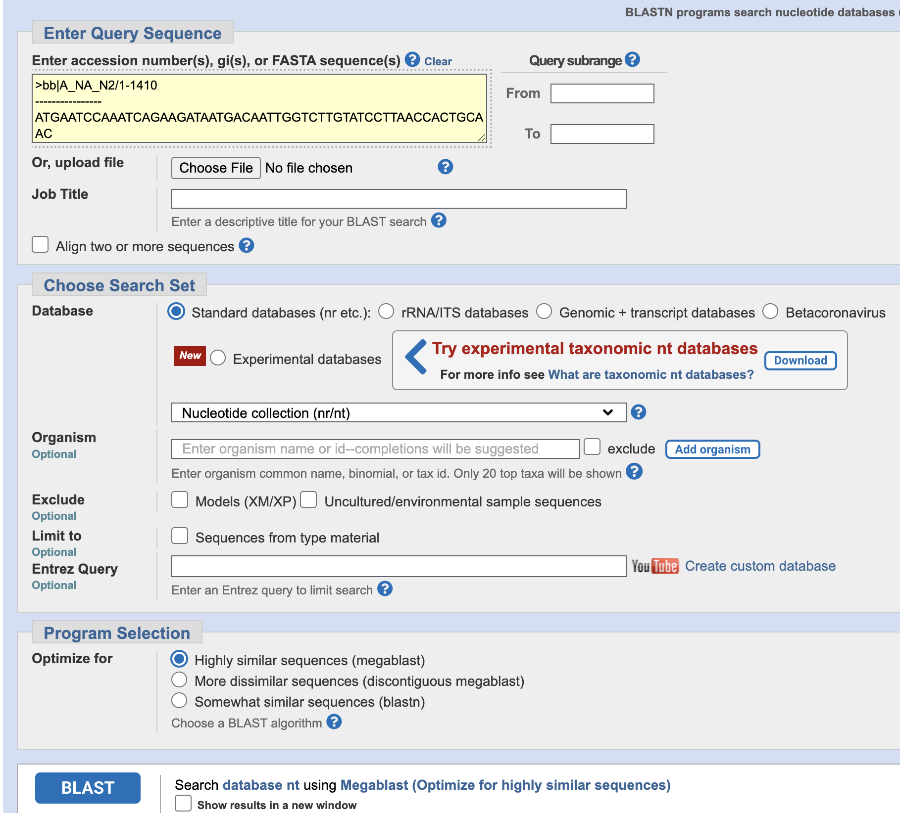

# Post-MIRA consensus sequence analysis practical
[_Answers here_](./training-answers.html)

## Influenza
Using MIRA-passed, influenza consensus sequences, you will determine their clades and how different they are from the 
vaccine strains [recommended by the World Health Organization for the northern hemisphere 2022/23 
season](https://www.who.int/teams/global-influenza-programme/vaccines/who-recommendations).

### Goals
1. Assess the quality of your consensus sequences with MIRA.
2. Identify which [nextclade](https://clades.nextstrain.org/) module to use to analyze consensus sequences.
3. Gather the required consensus sequences into a file and upload to nextclade.
4. Identify the HA and NA subtypes for each consensus sequence.
5. Identify number of variants in consensus sequences.
6. View where sequences are placed on nextstrain reference tree.
7. Manually edit frameshifts with [Jalview](https://www.jalview.org/)

### Practical
1. [Click here to download testdata](https://centersfordiseasecontrol.sharefile.com/d-s4d3bbf8ecfeb4df18ed546c7af8286eb).
_You will be required to put in your name and email._
2. Unzip the file into the folder that MIRA accesses runs (ie. MIRA_NGS).
3. Open MIRA and load the run "2023_Paris_Flu_training"
    * Which sample had the fewest reads? How many reads did it have?
4. Does the negative control pass?
5. What are some common reasons that segments do not pass quality control?
6. What HA and NA subtypes are present?
7. Take a look at the Reference Variants of the HA segment in sample "aa".
    * What do the X's mean and why are so many of the amino acids marked this way in sample "aa"?
8. Which samples and segments have minor variants greater than 20%? What does this mean for the amended consensus sequences?
9. Download the fasta sequences and open in JalView or your preferred sequence viewer.
10. In your internet browser, navigate to [Nextclade](https://clades.nextstrain.org/).
11. What Flu A subtypes have modules available in Nextclade?
12. Which pathogen module uses the WHO recommended vaccine virus for the H1 2022/23 seasonal component as a reference?
13. Select that module and copy the HA sequence from the H1N1 sample from your sequence viewer and paste into the sequence input box and run Nextclade.
14. What QC metric is flagged as being a concern for this sequence? What position in the sequence is the problem?
15. Download the aligned fasta sequence from nextclade to manually edit the sequence and fix the frameshift. Given this is a single base deletion that causes a frameshift, we can confidently say this is an error in sequencing. Insertion and deletion errors are unfortunately common from nanopore sequencing, particularly at homopolymer sequences. 

After copying the edited sequences, open the amended_consensus.fasta file from MIRA, delete the offending sequence and add in the corrected sequence from your clipboard and save this as your updated fasta file to be submitted to GISAID/NCBI.

16. Repeat the nextclade analysis with the corrected sequence. How many mutations does it have versus the reference?
17. View where the sequence is placed onto a nextclade reference tree by clicking in the top right corner.

### H1N2
Nextclade only supports seasonal human influenza H1N1 and H3N2 at this time. To understand what the HA is most like from the H1N2 sequence, we can use [NCBI BLAST](https://blast.ncbi.nlm.nih.gov/Blast.cgi?PROGRAM=blastn&BLAST_SPEC=GeoBlast&PAGE_TYPE=BlastSearch).

18. Copy the HA from the H1N2 sequence into the BLAST Query box, leave the settings at the default, and click BLAST at the bottom.

19. What host is the likely origin of this sequence?

## SARS-CoV-2 
Using MIRA-passed, SARS-CoV-2 spike consensus sequences, determine their clades and how different they are from Wuhan-1.
