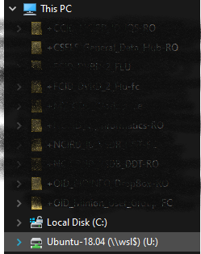

# Troubleshooting

<hr>

## MIRA installation failed
MIRA installation with docker compose expects an Ubuntu 18+ operating system or WSL2 distribution. If you have this, perform the following:

   1. Restart your computer
   2. Add google's domain name server (DNS) to /etc/resolv.confirm
      
        ```bash
        sudo echo 8.8.8.8 >> /etc/resolv.conf
        ```
   3. Open Docker Desktop and select all containers and Delete them.
    
    
   
   4. Go to [Installing MIRA](./articles/mira-installation.html)

[Return to contents](#Contents)

<hr>


## WSL install error
From the Windows search bar, open `Turn Windows Features on or off` and make sure the following 4 features are enabled:

* Hyper-V
* Virtual Machine Platform
* Windows Hypervisor Platform
* Windows Subsystem for Linux


## Map network drive

**_Many computers have trouble with this step; the folders are not selectable during this step. First, make sure that an Ubuntu terminal is opened and then open the `File Explorer`. If "Ubuntu" is still not showing up in `File Explorer`, you can try to find the solution here: [https://github.com/microsoft/WSL/issues/3996](https://github.com/microsoft/WSL/issues/3996)._

1. Open <a href="./images/file_explorer.png" target="_blank">File Explorer</a>
    - _If you have a Windows 10 or 11 OS, WSL is likely automatically mapped and visible in the left hand sidebar as "Ubuntu"_
2. Right click <a href="./images/map_drive_1.png" target="_blank">This PC and click Map network drive</a>
3. Enter `\\wsl$` into Folder: <a href="./images/map_drive_2.png" target="_blank">and click Browse</a>
4. Click on `wsl$` to unfold directories, select `Ubuntu-18.04` <a href="./images/map_drive_3.png" target="_blank">and click OK</a> and then `Finish`. You should now see your WSL "drive" available in `File Explorer`:

    

## Docker CLI errors
- If you get an error related to starting Docker, run the following command, then try to run hello-world again

```bash
sudo service docker start
```
- If you get an error related to "Permission Denied" of docker.sock, run the following command, then try to run hello-world again

```bash
sudo chmod -755 /run/docker.sock
```

- If your hello-world container still is not showing, open the Ubuntu-22.04 command prompt and run:

```bash
docker run -d -p 80:80 docker/getting-started
```

## Virtualization error 
- If you see a message relating to Virtualization needing to be enabled, follow instructions below to access your machine's BIOS setup:
    - [Windows 11 virtualization instructions](https://support.microsoft.com/en-us/windows/enable-virtualization-on-windows-11-pcs-c5578302-6e43-4b4b-a449-8ced115f58e1)
    - [Windows 10 virtualization instructions](https://www.geeksforgeeks.org/how-to-enable-virtualization-vt-x-in-windows-10-bios/) 


[Return to contents](#Contents)