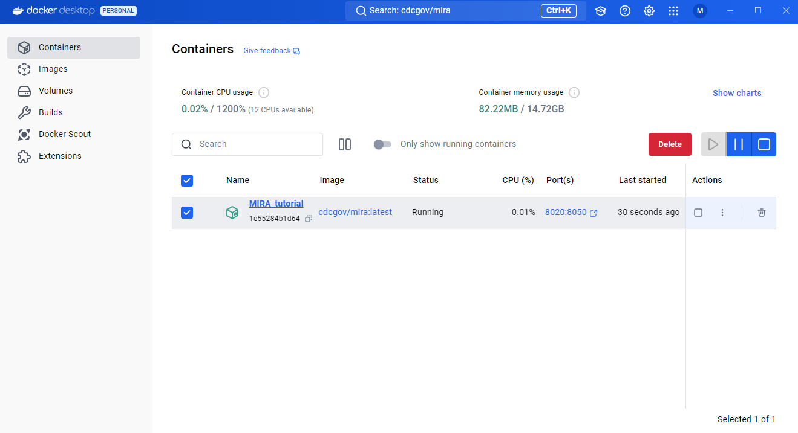
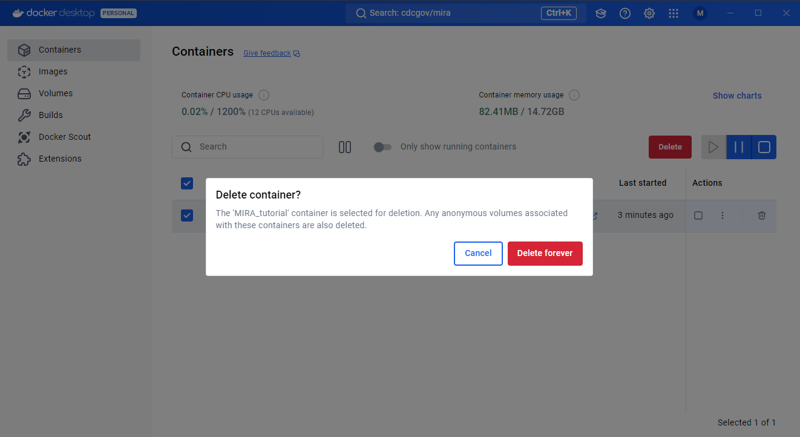
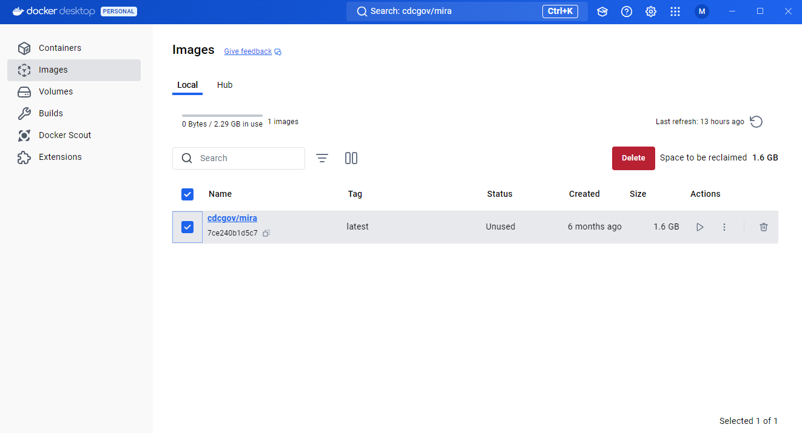
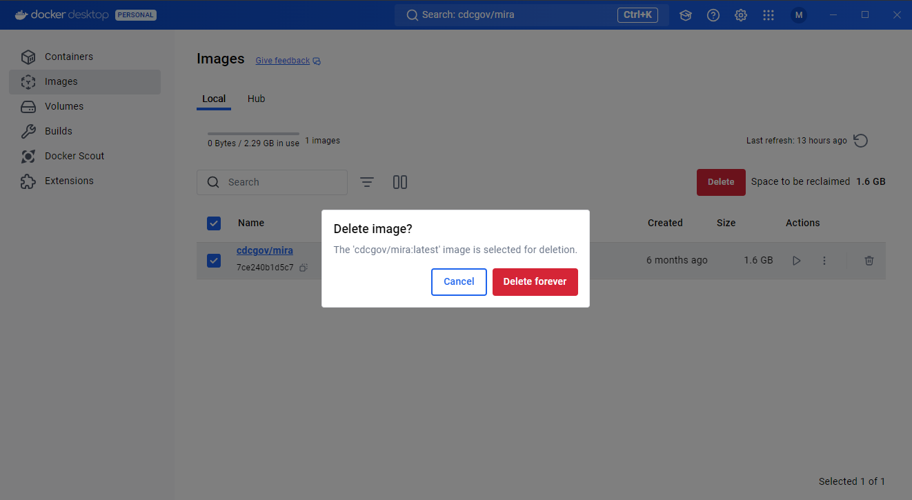

## How to upgrade MIRA to the latest version in Docker Desktop

1. Go to the containers tab in Docker Desktop and select all containers. Then press the stop button.

2. Then press delete. You will be asked to confirm that you want to delete the container.

3. Go to the images tab in Docker Desktop and select the MIRA image. Then press delete.

4. You will be asked to confirm that you want to delete the image.

5. Then re-pull the latest MIRA image as instructed [here](mira-dd-getting-started.html)